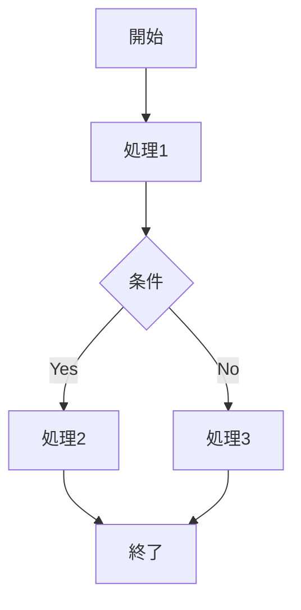

# MD Mermaid Flowchart

## 目的

MarkdownのMermaidフロー図を、パーサ互換性を優先して安定作成・修正する。

## 最小ワークフロー

1. 図の境界を固定する
- 始点、終点、分岐条件、合流点を先に箇条書きで確定する。
- ノード追加前に「何を図に含めないか」も明記する。

2. 互換モードで骨組みを作る
- `flowchart TD` を使う。
- 1ステートメント1行で記述し、行末に `;` を付ける。
- ノードラベルは `A["..."]` 形式で統一する。
- まずはノードと矢印のみで成立させ、装飾は後から追加する。

3. 互換性ガードを守る
- `subgraph` 内の `direction` は使わない。
- ラベル内で ` ` を使わない。
- ラベル内で `<=` `>=` `->` など記号連続を使わない。
- 行中コメント（`%%`）は使わない。
- 互換性問題が疑わしいときは、分岐ラベル以外の記号を日本語語句へ置換する。

4. parse errorを潰す
- エラー行の直前行までを最小再現として切り出す。
- 直前ノードの閉じ括弧 `]` `}` と行末 `;` を先に確認する。
- エラーが続く場合は、該当ブロックを「単純ノード + 単純矢印」に落として再構築する。

## 互換テンプレート

## 仕上げチェック

- ノードID重複がない。
- すべての行が単体で完結している。
- エラー時に問題行の1行上を最優先で確認した。
- Markdown Preview（`Markdown Preview Mermaid Support`）で表示確認した。
