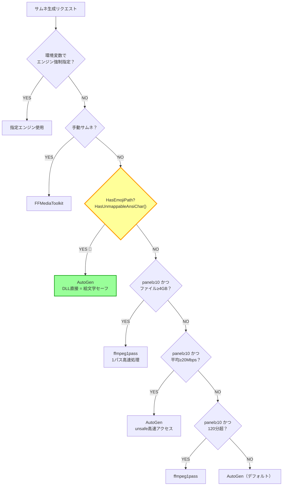
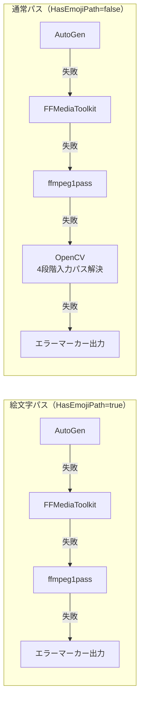

# 🤩 絵文字パス対応の現在地 — 全レイヤー完全ガイド！

> **更新日: 2026-03-01** | 既存ドキュメント: [症状と対策](EmojiPathMitigation_絵文字問題%20症状と対策.md) / [詳細設計](EmojiPathMitigationDetailDesign.md)

## 問題：なぜ絵文字パスは怖いのか？😱

Windowsの多くのネイティブライブラリ（OpenCV, ffmpeg CLIなど）は内部でANSI（CodePage 932）経由のファイルアクセスを行う。
絵文字（🎬📁✨ 等）はANSIに変換不可能なUnicode専用文字のため、**パスが文字化けしてファイルが開けない・保存できない** 💀

---

## 現在の対応状況マップ 🗺️

| レイヤー | 対応状況 | 方式 |
|---------|:-------:|------|
| ファイル名に絵文字 | ✅ 完全対応 | DLL系エンジンで一発突破（OpenCVフォールバックなし） |
| フォルダ名に絵文字 | ⚠️ 限定対応 | Junction/HardLink で回避（一部環境で制限あり） |
| サムネイル生成（絵文字パス） | ✅ 完全対応 | AutoGen/FFMediaToolkit/ffmpeg1pass（DLL直接）のみ |
| サムネイル生成（通常パス） | ✅ 完全対応 | 全エンジン使用可（OpenCV含む） |
| サムネイル保存 | ✅ 対応済 | `.NET Bitmap.Save` → JPEG直接保存 |
| DB登録（SQLite） | ✅ 対応済 | .NETのUnicode対応で問題なし |
| Everything検索 | ✅ 対応済 | IPC経由のUnicode対応で問題なし |
| エンジンルーティング | ✅ 対応済 | `HasEmojiPath` で自動判定＆OpenCV除外 |

> 💡 **ポイント**: 絵文字パス時はOpenCVが**フォールバック候補からも完全除外**されるため、
> ANSI制約に起因する4段階入力パス解決は**一切発動しない**！

---

## 絵文字判定のしくみ 🧠

`ThumbnailEngineRouter.HasUnmappableAnsiChar()` が全ての起点！

```csharp
// Encoding.GetEncoding(932) で変換を試み、例外が出たら絵文字判定
public static bool HasUnmappableAnsiChar(string text)
{
    try { _ = AnsiEncoding.GetBytes(text); return false; }
    catch { return true; }
}
```

- サムネ生成時に `ThumbnailJobContext.HasEmojiPath` としてセット
- エンジンルーターがこのフラグを見てエンジン選択 + フォールバック順を決定
- 処理コスト: **数μs**（メモリ上のバイト変換のみ、毎回判定でOK）

---

## FFMediaToolkit（DLL）導入による革命 🎉

**最大の戦果: ffmpeg CLI → DLL化で絵文字問題を根本解決！**

| 方式 | 絵文字パスの扱い |
|------|:---------------:|
| ffmpeg CLI（旧） | ❌ コマンドライン引数がANSI経由で文字化け |
| DLL系エンジン（現） | ✅ .NETのUnicode文字列をそのまま渡せる！ |

---

## 4段階入力パス対策（OpenCVが選ばれた場合のみ）⚔️

> ⚠️ **絵文字パス時はこの処理は発動しない！** OpenCVがフォールバック候補から除外されるため。
> 通常パスでOpenCVが選ばれ、かつ読み込みに失敗した場合のみ使われる。

```
1. Raw（生パス）→ そのまま直接アタック！🔥
   ↓ 失敗
2. ShortPath（短縮名）→ GetShortPathName API で8.3形式に変換
   ↓ 失敗
3. Junction / HardLink → ASCII一時フォルダに再解析ポイント作成 🔗
   ↓ 失敗
4. Copy（コピー）→ 最終奥義！安全な場所に丸ごとコピー
   ※ 3GB超はDeferred（後回し）にして確認を挟む
```

---

## まだ残ってる課題 🚧

1. **フォルダ名に絵文字がある場合のJunction作成**: 一部のNTFS環境やネットワークドライブで制限がある
2. **超大容量ファイル（3GB超）のコピーフォールバック**: Deferred機構はあるが、UXをさらに改善余地あり

---

## 絵文字判定の振り分けフロー図 🔀

### エンジン選択ルーティング（ResolveForThumbnail）



### フォールバック順（エンジン失敗時の次候補）



---

## 関連ファイル 📂

- `Thumbnail/ThumbnailCreationService.cs` — エンジン順序構築＋OpenCVスキップ＋保存フォールバック
- `Thumbnail/Engines/ThumbnailEngineRouter.cs` — 絵文字判定 `HasUnmappableAnsiChar` + ルーティング
- `Thumbnail/Engines/ThumbnailJobContext.cs` — `HasEmojiPath` プロパティ
- `Thumbnail/Decoders/FfMediaToolkitThumbnailFrameDecoder.cs` — DLL直接デコード（絵文字セーフ）
- `Thumbnail/Decoders/OpenCvThumbnailFrameDecoder.cs` — OpenCV経由（通常パスのみ使用）

