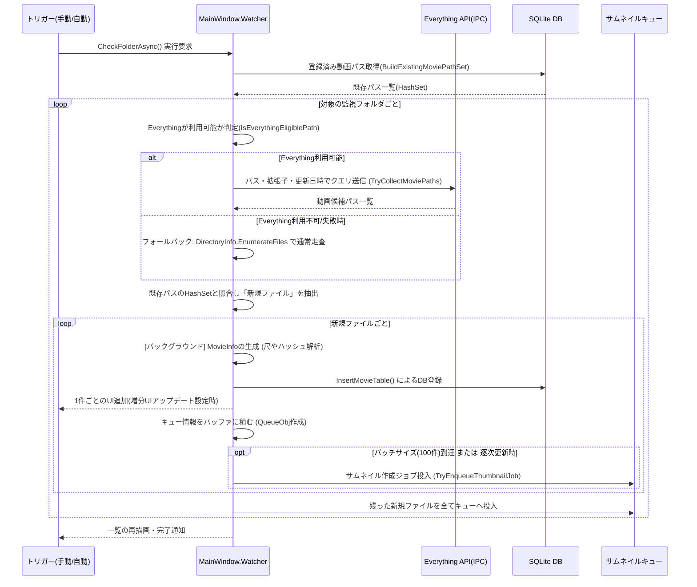

# EverythingからDBへの登録フロー

本ドキュメントでは、IndigoMovieManagerにおいて高速ファイル検索エンジンである「Everything」を利用し、監視フォルダ内の新規動画ファイルを検出してDBへ登録し、さらにサムネイル作成キューへ連携するまでの一連のフローをまとめます。
（※リクエストの「*.wb」はコンテキストから「DB(Database)への登録プロセス」あるいは「特定の拡張子の動画ファイル群の登録」として解釈しフローを描画しています）

## 処理の全体像

フォルダ監視の更新実行時（`CheckFolderAsync`）に起動し、以下の主要ステップで処理が行われます。

1. **DB上のキャッシュ構築**: DB（`movie`テーブル）から既に登録済みの動画パスをメモリ上のHashSetへ読み出し、重複判定を高速化します。
2. **対象ファイルの走査 (Everything連携)**: EverythingのIPC通信を用い、OSのファイルシステム走査より高速に監視フォルダ内の対象拡張子ファイルを取得します。
3. **新規ファイル判定とDB登録**: メモリ上のキャッシュと突き合わせて未登録のファイル（新顔）だけを抽出し、動画情報を解析後、順次SQLiteのデータベースへ `INSERT` します。
4. **サムネイル作成キューへのエンキュー**: DBに登録した新規ファイルオブジェクトをサムネイル生成キューへ投入します。

---

## フロー図 (Mermaid)

## 各コンポーネント・メソッドの役割

| コンポーネント / メソッド | 役割・概要 |
| :--- | :--- |
| **`CheckFolderAsync`** | 全体の統括。UI表示の制御、並列性の管理、各ステップ（DB登録やキュー投入）の調整を行う。 |
| **`EverythingFolderSyncService`** | EverythingとのIPC通信を隠蔽。検索設定（統合モード等）やクエリ文字列の組み立て（`"パス" ext:mp4`等）を担う。 |
| **`FolderScanWithStrategyInBackground`** | 「Everythingが使えるか？」の判定と高速スキャンを実行。対象外のドライブ（ネットワーク等）やエラー時は、標準のファイルシステム走査（フォールバック）に切り替える。 |
| **`BuildExistingMoviePathSet`** | `movie` テーブルから全登録ファイルパスを引き抜き高速な `HashSet` を構築する。Everythingからの返却件数が多くてもここでのルックアップは `O(1)` となる。 |
| **`InsertMovieTable`** | 抽出した新規ファイルから生成された `MovieInfo` を実DBへ永続化する。 |
| **`TryEnqueueThumbnailJob`** | サムネイルキュー生成プロセスに対して、DB登録が終わった対象ファイルの処理要求を非同期で投げる。 |

## 主な特徴・工夫
- **メモリ・I/O保護の並列設計**: `MovieInfo`の解析（ファイルの実体アクセス）やDBの`INSERT`を `Task.Run` に逃がすことで、UIスレッドのフリーズを防ぎます。
- **高速なフォールバック設計**: 初めからEverythingを見に行き、例外や上限オーバー(`SearchLimit`など)に当たった時だけ通常走査に戻るセーフティネットがあります。
- **バッチ(まとまり)でのエンキュー**: フォルダ内に数千～数万の動画が見つかった場合でも、`FolderScanEnqueueBatchSize` (デフォルト100件)に達するごとにキューへ流す実装になっており、サムネイル作成の初動を早めつつ瞬時の負荷スパイクを分散しています。
