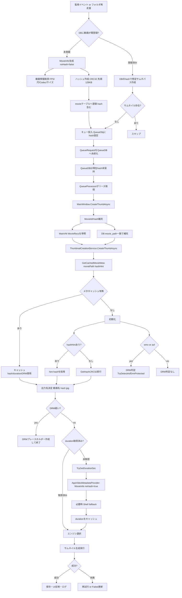

# Flowchart（動画情報取得・サムネイル作成・ハッシュ作成タイミング 2026-03-04）

## 1. 全体フロー（現行コード）

## 2. タイミング要点
- ハッシュ作成タイミング1（DB未登録時）  
  `MovieInfo(noHash=false)` 生成時に作成。
- ハッシュ作成タイミング2（サムネイル生成時）  
  `ThumbnailCreationService.GetCachedMovieMeta` のキャッシュミス時。  
  ただし `hashHint`（Queue/UI/DB補完）取得済みなら再計算しない。
- WMV/ASFのDRM判定タイミング  
  `GetCachedMovieMeta` 初期化時（= ハッシュ決定と同じタイミング）で実行。
- 動画情報取得タイミング  
  - DB未登録時: `MovieInfo` でFPS/尺/Codec等を取得。  
  - サムネ生成時: duration不足時のみ `videoMetadataProvider.TryGetDurationSec`（`noHash=true` 経路）。
- サムネイル作成タイミング  
  QueueProcessor がQueueDBからジョブをリース後、`CreateThumbAsync` を実行。

## 3. 補足（命名ゆれ対策）
- 以前は `hash` が空のまま到達すると `動画名.#.jpg` になり得た。
- 現在は `CreateThumbAsync` 前段で `MovieRecs` またはDBから `hash` を補完し、命名ゆれを抑制。
- それでも「DB側hash空 かつ ハッシュ読取不可」の場合のみ、空hash名になる可能性は残る。

## 4. 参照コード
- `Watcher/MainWindow.Watcher.cs`
- `Models/MovieInfo.cs`
- `Thumbnail/Tools.cs`
- `Thumbnail/MainWindow.ThumbnailCreation.cs`
- `Thumbnail/ThumbnailCreationService.cs`
