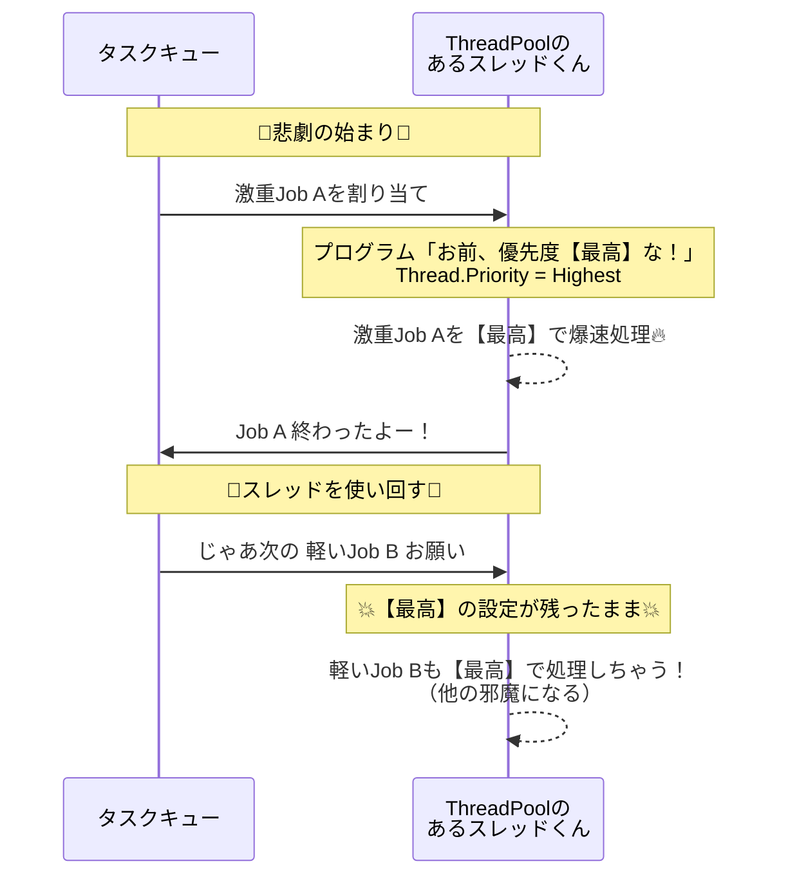

# 🚀 サムネイル生成：並列処理をもっと賢くコントロールしたい！🔥

ヤッホー！サムネ生成の並列処理、もっと賢くコントロールしたいよね！✨
「重い動画で処理が詰まる」「もっとサクサク進んでる感を出したい」という悩みを解決するための、最強の設計方針を図解入りでチョー詳しく解説するよ！🥰

---

## ❓ Q1: 大動画で詰まるのを解消したい。「スレッドごとに優先度をコロコロ変えられないの？」

### 💡 ズバリ結論！
今の実装（`Task` + `ThreadPool`）のまま「スレッド自身の優先度」を動的に変えるのは**実用的じゃない（むしろ罠がいっぱい）**なんだ💦

### 🛑 なぜ「スレッド優先度」の変更はヤバいのか？（罠ポイント）
`Thread.Priority` を自由にいじれるのは、基本的に**「専用のスレッド（自分で作ったThread）」**を運用している時だけ。
今のC#の主流である `Task` や `ThreadPool` は、**「エコのためにスレッドを使い回す」**仕組みになってるんだ。

ここでスレッドの優先度をいじると、**「他の処理に優先度の変更が漏れちゃう（汚染される）」**っていう恐ろしい現象が起きるよ😱

#### 📉 スレッド優先度変更の「漏れ」を図解！



**✅ だから解決策はコレ！**
スレッドの設定を直接いじるんじゃなくて、スレッドより手前の**「キュー（待ち行列）の仕組み」を賢くする（ジョブ優先度制御）**のが大正解！🥰

---

## ❓ Q2: じゃぁ「小さい動画（すぐ終わるやつ）を先に1本流す」ってどうよ？

これ、**めっちゃ良いね！**✨
すぐ終わるやつを先に流すのは、ユーザーの「あ！進んでる！」って体感速度を爆上がりさせるからマジで最強の施策だよ！

ただし、実装する時に**絶対に気をつけてほしい罠（注意点）**があるんだ！

### 💀 罠：「ThreadPool + 固定スレッド2本」の単純加算はNG！
「全体並列数が N だから、そこに別で小さい動画用と大動画用のスレッドを +2 しちゃおう！」
…ってやると、**「過並列（同時に処理しすぎ）」になって逆に全体が遅くなっちゃう**んだ💦

### 💡 正解：全体枠（N）の中での「レーン（車線）分割」アプローチ

1つの巨大な道（全体並列数 N：例えば4）の中で、**「車線を分ける」**のが一番安全で速い！

1. 全体並列数 `N` は**絶対にこれ以上増やさない**（PCの限界値として死守！）。
2. その `N` の中で、以下のように「枠」を予約してあげる。
   - 🚗 **小動画レーン：1枠**
   - 🚚 **大動画レーン：1枠** （詳しくは次のQ3で！）
   - 🚙 **通常レーン：残り（N - 2）枠**
3. もし「小動画のキューが空っぽだよ！」って時は、その枠を通常レーンに貸し出してフル稼働させる（枠の相互貸与）。
4. DBからの仕事の取り方（リース取得）は、`ORDER BY MovieSizeBytes ASC`（小さい順）と `DESC`（大きい順）の2系統を用意する。

#### ✨ レーン分割のイメージ図解！

```mermaid
flowchart TD
    subgraph DBからの仕事取得
        DB[(データベース)]
        DB -->|小さい順<br>ASC| Q_Small[小動画キュー<br>軽トラ専用]
        DB -->|大きい順<br>DESC| Q_Large[大動画キュー<br>ダンプカー専用]
        DB -->|通常| Q_Normal[通常キュー]
    end

    subgraph 全体並列数 N の制限ゲート（限界は超えない！）
        Q_Small --> L_Small[小動画レーン<br>1枠予約]
        Q_Large --> L_Large[大動画レーン<br>1枠予約]
        Q_Normal --> L_Normal[通常レーン<br>残り枠]
        
        L_Small -.->|空いてれば貸す| L_Normal
        L_Large -.->|空いてれば貸す| L_Normal
    end
```

---

## ❓ Q3: 「大動画レーン（1枠）も加えて、他の邪魔にならないように優先度を徹底的に下げて（隅っこでゆっくり走らせて）、詰まりを防ぎたい！」

これ、**可能**だよ！😎
しかも、4K動画などの激重処理がずーーっとリソースを占有しちゃう問題をスマートに解決できる！

さっきQ1で言った通り、「OSのスレッド優先度（`Thread.Priority`）」は使わない。
代わりに**「スケジューラ優先度（プログラムの仕組みで意図的に後回しにする）」**を使って徹底的に弱体化（デバフ）させるのが絶対的に安全なやり方！🔥

### 🛠️ 大動画を徹底的に低優先にする（間引き運転する）テクニック

大動画レーンは「同時実行1」を死守しつつ、さらに以下の**厳しい条件（デバフ）**をつける！

1. **起動条件を厳しくする** 🚦
   - いつでも走れるわけじゃない。例えば `QueueActiveCount >= threshold`（全体の枠に少し余裕がある時）しか動かさない！
2. **UI操作中は一時停止** ⏸️
   - ユーザーが画面を触ってる時（DB更新やスクロールなど）は、大動画の処理（激重）はストップして全体のサクサク感を優先する！
3. **余剰枠がある時だけ動かす（トークン配分を下げる）** 🎟️
   - 小動画レーンや通常レーンに先に「実行枠」を配る。もし全員の処理が終わって、それでも枠が余ってたら大動画に渡してあげる。
4. **DBリース（仕事の取り方）での弱体化** 📉
   - 一回で取得する件数を**常に「1件だけ」**にする（一度にたくさん抱え込まない）。
   - 次の仕事を取りに行く**間隔（ポーリング間隔）を長めにする**（連投しない、すぐにおかわりしない）。

ここまでやれば「大動画」は完全に低優先になり、PCのリソースを食いつぶすことなく、バックグラウンドの隅っこでひっそり完了してくれる最高のシステムになるよ！✨

---

### 🌟 まとめ！
1. スレッドを直接いじらず、**「ジョブ」**として優先順位をコントロールする！
2. 全体の並列数 N の中で**「小動画用」「大動画用」のレーンを分ける**！（決してNはみ出さない）
3. 大動画は徹底的にシステム側で**「後回し（デバフ）」**にして邪魔させない！

このQ&A神構成の設計で全体像はカンペキだね！コード書いてバグごと消し飛ばそう！🔥
