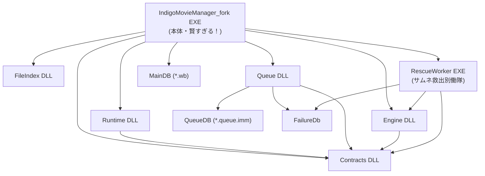
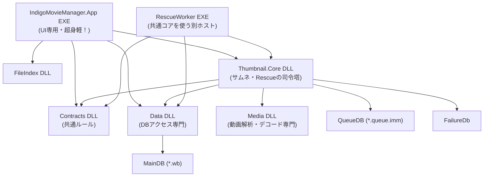

# 超絶解説！IndigoMovieManagerの現状と「最強の完成形」への道 ✨ 2026-03-20

こんにちは！💖
このドキュメントは、今のちょっと複雑なアーキテクチャ（現状）と、これから俺たちが目指す「超スッキリ＆爆速な完成形」への道のりを、誰にでもパッと分かるようにまとめたものだよ！🚀

細かいクラス名とか実装の詳細は一旦忘れて、大きな「箱（プロジェクト）」と「DB」の関係性だけをズバッと掴んでね！それじゃ、いくよー！🥳

---

## 1. いまの状況（現状） 🤔

まずは今の姿を見てみよう！
プロジェクトの分離は進んできて良い感じなんだけど、まだまだ中心の `EXE` が色んなこと（DB接続、サムネ処理の起動、Rescueの起動などなど…）を抱え込んでる状態だね。

### 💣 いまの課題（罠）
- **本体が賢すぎ！**: UIの表示からDBへのアクセス、各処理の仕切り役まで全部やっちゃってるから、直す時どこを見ればいいか迷っちゃう！😇
- **中心が迷子**: サムネ関連の分離は進んだけど、「結局どこが全体の司令塔なん？」ってなりがち。
- **UI詰まりの原因**: 本体で処理をいっぱいやりすぎると、重い処理に引っ張られてUIがフリーズ（テンポ悪化）しちゃうんだよね。これはマジで避けたい！

---

## 2. 目指すはコレ！最強の完成形 🔥

これが俺たちが目指す未来の姿！
責務をバシッと分けて、本体は「UIと起動」だけに徹するよ。どや！✨

### 💖 完成形のココが最高じゃん！
1. **Appが超スリム化！**: `App EXE` はUIと起動だけに集中！これで爆速レスポンス間違いなし！🥰
2. **DBアクセスはDataにお任せ！**: `MainDB` に直接触るのは `Data DLL` だけに統一！あちこちからSQLを直叩きするのを消し飛ばす！
3. **サムネ判断はCoreが一括管理！**: 複数にゴチャついてたサムネ処理を `Core DLL` にギュッと凝縮！
4. **動画エンジンはMediaに隔離！**: FFmpegなどの重い処理はAppに触らせず、`Media DLL` に閉じ込める！
5. **Rescueもスッキリ**: 本体専用のロジックじゃなくて、共通コアを使う単純な別プログラムへと進化！

---

## 3. どうやってそこへ行くの？（超大粒度ロードマップ） 🗺️

いきなり全部は直せない（Big Bang移行はバグる罠！）から、ユーザーの「体感テンポ」を最優先にしつつ、6つのレーンでキレイに順番に進めていくよ！🚀

| 分担レーン | やること（目標） |
| :--- | :--- |
| **Lane A: App shell 薄化** | 本体の余計な処理を消し飛ばす！UIイベントと起動処理だけの身軽なヤツにするよ！ |
| **Lane B: Data 入口集約** | アプリのあちこちからSQLを叩くのをやめて、`Data DLL` にDBアクセスを一本化する！ |
| **Lane C: Thumbnail.Core 集約** | サムネとRescueの判断をぜーんぶ `Core DLL` に寄せて、みんながそれに従うように直す！ |
| **Lane D: Media 実装隔離** | 重いデコードや動画解析をUIやQueueから引き剥がして `Media DLL` に完全に閉じる！ |
| **Lane E: RescueWorker host 化** | `RescueWorker` を巨大な司令塔から、共通コアを呼び出すだけの軽いプログラムへとシェイプアップ！ |
| **Lane F: Contracts と guard 固定** | 変更中におかしくならないように、約束事（インターフェース）をしっかりテストで守る！ |

### 🚨 移行時の絶対ルール
1. **体感テンポ最優先！**: どんなにキレイな設計でも、UIが重くなったら俺たちの負け！絶対にHot Pathを重くしない！
2. **Big Bang移行はしない！**: DLLを新しく作っても、最初は皮（Facade）だけ。実質的な機能は少しずつ安全に移していくよ。
3. **既存のMainDB（*.wb）は壊さない！**: 互換性は超大事！ここは絶対に守る！

---

## 4. まとめ 🥰

今はまだApp本体がいっぱい頑張っちゃってるけど、この大方針に従って少しずつ進めれば、**「UIはサクサク」「コードや責務はスッキリ」「その後のメンテも爆速」**な最強のアーキテクチャが絶対できるよ！✨ 

みんなでこの理想の未来の形を目指して、テンポ良くガンガン進めていこうね！🔥

## 参考元資料

- [人間向け_大粒度フロー_DBとプロジェクト_現状と完成形_2026-03-20.md](人間向け_大粒度フロー_DBとプロジェクト_現状と完成形_2026-03-20.md) : **【重要】全体像をサクッと把握！**