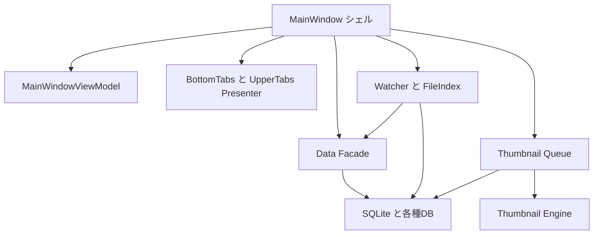

# IndigoMovieManager Project Overview

最終更新日: 2026-04-01

## 1. この文書の目的

この文書は、IndigoMovieManager に新しく入る開発者が、現状のコードベースを短時間で理解するための正本です。

最初に知りたい次の内容を、1 本でつかめるようにしています。

- このアプリが何をするか
- いまのアーキテクチャがどうなっているか
- どこから読めばよいか
- どこを触る時に何を壊しやすいか
- 作業テーマごとに、どの資料とコードを見ればよいか

細かい実装計画、過去の試行錯誤、個別障害の記録は別資料に譲ります。
この文書では「現状の地図」と「安全な入口」を優先します。

## 2. 最初に押さえる前提

IndigoMovieManager は、WhiteBrowser 互換を重視した動画管理用の WPF デスクトップアプリです。

現在の特徴は次の通りです。

- メイン DB は WhiteBrowser 互換の `*.wb` を正本として扱う
- 動画一覧、検索、タグ編集、履歴、ブックマークを扱う
- フォルダ監視で新規動画や変更動画を取り込む
- サムネイル生成は QueueDB を使って UI から切り離して実行する
- 通常生成で失敗した動画は FailureDb と RescueWorker で救済する
- 監視候補の収集は Watcher と FileIndex 系に分離されている

## 3. 今のアーキテクチャを一言で言うと

このコードベースは、全面的な純粋 MVVM ではありません。

現状は、

- `MainWindow` をシェル兼オーケストレータとして残しつつ
- `ViewModel` で表示状態を持ち
- 重い責務を `Facade`、`Coordinator`、`Presenter`、`Factory`、`Policy` に段階的に逃がしている

というハイブリッド構成です。

そのため、理解のコツは「最初から全部を綺麗な層構造として見る」のではなく、

1. `MainWindow` が何を起動しているかを見る
2. watch と thumbnail の重い流れを見る
3. その後で ViewModel / Facade / Presenter の責務境界を見る

の順で追うことです。

## 4. 全体像

見る時の要点:

- 画面の司令塔は `Views/Main/MainWindow.xaml.cs`
- 表示状態の中心は `ViewModels/MainWindowViewModel.cs`
- watch 系は `Watcher/`
- サムネイル系は `Thumbnail/` と `src/IndigoMovieManager.Thumbnail.*`
- DB の正本は `*.wb`、非同期処理の補助 DB は LocalAppData 側

## 5. プロジェクトとフォルダの見方

### 5.1 本体

- `IndigoMovieManager.csproj`
  - WPF アプリ本体
  - 画面、起動、DB 切替、watch 起動、サムネイル常駐処理の起動を持つ

### 5.2 UI と表示状態

- `Views/`
  - WPF の画面定義
  - メイン画面は `Views/Main/`
- `ViewModels/`
  - UI 表示用の状態と一覧更新ロジック
- `BottomTabs/`
  - 下部タブ単位の UI ロジック
- `UpperTabs/`
  - 上部タブ単位の UI ロジック
- `UserControls/`
  - 再利用する UI 部品

### 5.3 監視と DB 反映

- `Watcher/`
  - 監視イベント、差分反映、UI 反映の入口
- `Data/`
  - MainDB の読み書き導線を整理する facade 群
- `DB/`
  - SQLite 基本処理、メイン DB アクセスの基盤
- `src/IndigoMovieManager.FileIndex.UsnMft/`
  - 高速ファイル索引の実装

### 5.4 サムネイル生成

- `Thumbnail/`
  - 本体アプリ側のサムネイル入口、UI 連携、補助ロジック
- `src/IndigoMovieManager.Thumbnail.Engine/`
  - 生成ロジック本体
- `src/IndigoMovieManager.Thumbnail.Queue/`
  - QueueDB、FailureDb、processor、queue pipeline
- `src/IndigoMovieManager.Thumbnail.Runtime/`
  - 保存先や runtime 共通ルール
- `src/IndigoMovieManager.Thumbnail.Contracts/`
  - 共有契約型
- `src/IndigoMovieManager.Thumbnail.RescueWorker/`
  - 救済用別 EXE

### 5.5 テストと補助資料

- `Tests/IndigoMovieManager.Tests/`
  - 境界仕様の確認にも使える
- `Docs/forHuman/`
  - 人向けの入口資料
- `Docs/forAI/`
  - 実装計画、調査、レビュー記録
- `Watcher/README.md`
  - watch 系の入口資料
- `Thumbnail/README.md`
  - サムネイル系の入口資料

## 6. 重要なデータの置き場所

このアプリは、1 個の DB だけでは完結しません。
役割ごとに保存先が分かれています。

### 6.1 メイン DB

- 形式: `*.wb`
- 役割: 動画一覧、履歴、設定などの正本
- 前提: WhiteBrowser 互換を壊さないこと

### 6.2 QueueDB

- 形式: `*.queue.imm`
- 保存先: `%LOCALAPPDATA%\{AppName}\QueueDb\`
- 役割: サムネイル生成待ちジョブの管理

### 6.3 FailureDb

- 形式: `*.failure.imm`
- 保存先: `%LOCALAPPDATA%\{AppName}\FailureDb\`
- 役割: 失敗記録と救済状態の管理

### 6.4 ログ

- 保存先: `%LOCALAPPDATA%\IndigoMovieManager\logs\`
- 役割: 障害切り分け、タイミング確認、性能調査

## 7. 最初に読むコードの順番

新規参入者は、次の順番で読むのがおすすめです。

1. `Views/Main/MainWindow.xaml.cs`
   - 何が起動し、どこへ委譲しているかを見る
2. `ViewModels/MainWindowViewModel.cs`
   - 一覧表示、検索、ソート、表示用コレクションを把握する
3. `Views/Main/MainWindow.Startup.cs`
   - 起動時の段階ロードと遅延起動の流れを見る
4. `Watcher/MainWindow.Watcher.cs`
   - 監視処理の本体を把握する
5. `Watcher/MainWindow.WatchScanCoordinator.cs`
   - watch 起点の反映単位を整理する場所を見る
6. `Thumbnail/MainWindow.ThumbnailCreation.cs`
   - 本体アプリからサムネイル生成へ入る流れを見る
7. `src/IndigoMovieManager.Thumbnail.Queue/ThumbnailQueueProcessor.cs`
   - QueueDB からジョブを処理する本体を見る
8. `src/IndigoMovieManager.Thumbnail.Engine/ThumbnailCreationServiceFactory.cs`
   - Engine 側の正規入口を見る
9. `src/IndigoMovieManager.Thumbnail.Engine/ThumbnailCreateWorkflowCoordinator.cs`
   - サムネイル生成の本流を把握する

## 8. 最初に理解するべき処理フロー

### 8.1 起動から一覧表示まで

1. `MainWindow` が起動する
2. 前回の DB と状態を復元する
3. 起動時ロードで first page を表示する
4. `MainWindowViewModel` に一覧を載せる
5. watch、queue、補助サービスを段階的に起動する

要点:

- 初回表示速度を優先して段階ロードしている
- 最初から全件を同期で読み切る設計ではない

### 8.2 監視から DB 反映まで

1. Watcher が変更候補を拾う
2. FileIndex 系で候補を絞る
3. `WatchScanCoordinator` が per-file / per-batch で整理する
4. MainDB へ反映する
5. UI へ差分反映する
6. 必要ならサムネイル生成キューへ積む

要点:

- watch 系は UI テンポを壊さないための guard が多い
- `Watcher/README.md` を先に読むと迷いにくい

### 8.3 サムネイル生成から救済まで

1. ジョブが QueueDB に積まれる
2. `ThumbnailQueueProcessor` がジョブを取得する
3. `IThumbnailCreationService` 経由で生成を実行する
4. 成功なら完了、失敗なら FailureDb へ記録する
5. RescueWorker が必要に応じて再挑戦する
6. 結果を UI に同期する

要点:

- サムネイル生成は UI 直結ではなく queue 中心
- 通常生成と救済生成は分離されている

## 9. 現在の設計パターン

新規参入者が名前だけ知っておくと読みやすくなるものを挙げます。

- `ハイブリッドMVVM`
  - ViewModel はあるが、全体制御はまだ `MainWindow` が強い
- `Facade`
  - DB 読み取りや watch 入口の整理
- `Coordinator`
  - 起動、watch、thumbnail の複数手順の調停
- `Factory`
  - サムネイル生成や provider 生成の正規入口
- `Presenter`
  - タブ単位の表示制御
- `Policy`
  - 条件分岐をまとめた判断ロジック
- `Queue`
  - サムネイル生成の非同期化

## 10. 触る時に守るべき境界

### 10.1 サムネイル系

守ること:

- `Factory + Interface + Args` の入口を守る
- `ThumbnailCreationService` を直接 new しない
- validator や coordinator の責務を service 本体へ戻しすぎない

見る入口:

- `ThumbnailCreationServiceFactory`
- `IThumbnailCreationService`
- `ThumbnailCreateArgs`
- `ThumbnailBookmarkArgs`

### 10.2 Watcher 系

守ること:

- 重い処理を UI スレッドへ戻しすぎない
- watch イベント処理と UI 反映を同じ場所へ抱え込みすぎない
- suppression や stale guard を削る時は理由を明確にする

### 10.3 MainDB 読み取り

守ること:

- hot path を無秩序に増やさない
- `DB/SQLite.cs` 直叩きだけで増築しない
- 既存 facade の責務を確認してから追加する

## 11. 症状別の入口

### 11.1 一覧や UI が重い

次を順に見てください。

- `Views/Main/MainWindow.xaml.cs`
- `Views/Main/MainWindow.Startup.cs`
- `ViewModels/MainWindowViewModel.cs`
- `Views/Main/UiHangNotificationCoordinator.cs`

### 11.2 監視や DB 反映がおかしい

次を順に見てください。

- `Watcher/README.md`
- `Watcher/MainWindow.Watcher.cs`
- `Watcher/MainWindow.WatchScanCoordinator.cs`
- `Data/WatchMainDbFacade.cs`
- `DB/SQLite.cs`

### 11.3 サムネイルが出ない

次を順に見てください。

- `Thumbnail/MainWindow.ThumbnailCreation.cs`
- `src/IndigoMovieManager.Thumbnail.Queue/ThumbnailQueueProcessor.cs`
- `src/IndigoMovieManager.Thumbnail.Engine/ThumbnailCreationServiceFactory.cs`
- `src/IndigoMovieManager.Thumbnail.Engine/ThumbnailCreateWorkflowCoordinator.cs`
- `src/IndigoMovieManager.Thumbnail.RescueWorker/RescueWorkerApplication.cs`

### 11.4 上下タブの表示や追従がおかしい

次を順に見てください。

- `BottomTabs/`
- `UpperTabs/`
- 各タブの `*Presenter.cs`
- `Views/Main/MainWindow.xaml.cs`

## 12. 新規参入者の最初の 1 週間の動き方

### Day 1

- `DevelopmentSetup_2026-02-28.md` で環境構築
- 本書を読む
- `Views/Main/MainWindow.xaml.cs` と `ViewModels/MainWindowViewModel.cs` を流し読む

### Day 2

- `Watcher/README.md` を読む
- `Watcher/MainWindow.Watcher.cs` と `Watcher/MainWindow.WatchScanCoordinator.cs` を追う

### Day 3

- サムネイル入口を読む
- `ThumbnailCreationServiceFactory` と `ThumbnailQueueProcessor` を追う

### Day 4 以降

- 自分の担当テーマに合わせて個別 docs を読む
- 変更前に関連テストと関連 `README.md` を確認する

## 13. まず読むべき文書

この文書を読んだ後は、次の順に進むと理解が安定します。

1. `DevelopmentSetup_2026-02-28.md`
   - 開発環境、ビルド、起動の前提
2. `Architecture_2026-02-28.md`
   - プロジェクト単位の責務
3. `ProjectFilesAndFolders_2026-04-01.md`
   - フォルダの場所と実ファイルの入口
4. `DatabaseSpec_2026-02-28.md`
   - DB の役割と保存先
5. `../../Watcher/README.md`
   - watch 系の入口
6. `../../Thumbnail/README.md`
   - thumbnail 系の入口

AI や実装担当者は、上記に加えて次も確認してください。

- `../../AGENTS.md`
- `../../AI向け_現在の全体プラン_workthree_2026-03-20.md`
- `../forAI/README.md`

## 14. この文書で扱わないもの

次の内容は、本書では深掘りしません。

- 個別 SQL の詳細
- 各サムネイルエンジンの細かい比較
- RescueWorker の個別動画向け調整史
- 過去の試行錯誤の詳細経緯
- 作業指示、差し戻し、レビュー結果の全履歴

必要になった時に、個別資料へ進んでください。

## 15. まとめ

新規参入者が最初に覚えるべきことは 3 つです。

1. 現在の中心は `MainWindow`、watch、thumbnail queue の 3 本柱であること
2. サムネイル系では `Factory + Interface + Args` の入口を守ること
3. 監視や一覧更新では UI テンポを優先した guard が多いこと

最初から全体を完璧に理解する必要はありません。
まずは「起動」「一覧」「監視」「サムネイル」の順に流れを 1 本ずつ追ってください。
