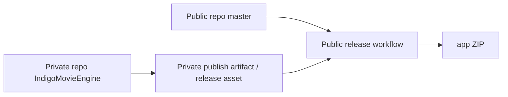

# master統合前 workthree変更説明とfork元統合ガイド 2026-04-05

最終更新日: 2026-04-05

## 1. この文書の目的

この文書は、`workthree` を `master` へ統合し、その後に fork 元へ PR を出す前に、

- このブランチで何が起きたか
- 何が単なる機能追加ではなく、運用や構成の変更なのか
- fork 元でどのように統合するのが安全か

を短時間で共有するための人間向け説明資料である。

## 2. 先に結論

`workthree` は単一機能の枝ではない。

`master..workthree` の差分は 2026-04-05 時点で `98` commit あり、主に次の 4 本が同時に進んでいる。

1. UI と一覧まわりの体感テンポ改善
2. 上下タブの presenter 化による責務分離
3. WebView2 を使う WhiteBrowser 互換 skin 基盤の導入
4. サムネイル救済 worker / engine の外だしと release 運用の再設計

特に 4 は「機能追加」ではなく「運用モデル変更」であり、fork 元がこの枝を取り込む時に一番先に判断すべき点である。

この枝の現在地を一言で言うと、

- Public repo は **app に機能を追加し、配る** 側へ寄せた
- Private repo は **engine / worker の正本** として独立させた

である。

## 3. fork元から見て何が起きているか

### 3.1 UI / 体感テンポの改善

`BottomTabs/` と `UpperTabs/` の責務を presenter へ逃がし、
`MainWindow` 直下へ集まりすぎていた表示制御を薄くしている。

代表例:

- `BottomTabs/Bookmark/BookmarkTabPresenter.cs`
- `BottomTabs/DebugTab/DebugTabPresenter.cs`
- `BottomTabs/ThumbnailProgress/ThumbnailProgressTabPresenter.cs`
- `UpperTabs/Rescue/UpperTabRescueTabPresenter.cs`
- `UpperTabs/Common/MainWindow.UpperTabs.SelectionFlow.cs`

意味:

- 画面の体感テンポ改善
- タブ単位の修正を局所化
- `MainWindow` の肥大化抑制

### 3.2 WhiteBrowser 互換 skin の新基盤

WebView2 を使う外部 skin 基盤が入り、WhiteBrowser 互換の skin 連携が前進している。

代表例:

- `WhiteBrowserSkin/Runtime/WhiteBrowserSkinRuntimeBridge.cs`
- `WhiteBrowserSkin/Runtime/WhiteBrowserSkinApiService.cs`
- `Views/Main/MainWindow.WebViewSkin.cs`
- `Views/Main/MainWindow.WebViewSkin.Api.cs`
- `Views/Main/Host/WhiteBrowserSkinHostControl.xaml`

意味:

- 従来の skin 表示を置き換える準備が進んだ
- `wb.*` 系 callback を段階的に寄せられる
- UI 本線とは別に、表示基盤そのものが更新されている

### 3.3 サムネイル救済の安定化

ユーザー指示のサムネイル作成 / 救済導線を見直し、
manual rescue の受付、popup / overlay、busy 時の返し、main tab 側の再読込まで一通り整理している。

代表例:

- `Thumbnail/MainWindow.ThumbnailCreation.cs`
- `Thumbnail/MainWindow.ThumbnailUserActionContext.cs`
- `Thumbnail/MainWindow.ThumbnailRescueManualPopup.cs`
- `Watcher/MainWindow.ThumbnailFailedTab.cs`

意味:

- 「受け付けたのに動かない」
- 「対象件数の popup がずれる」
- 「成功しても main tab が更新されない」

といった体感上の不安定さを潰している。

### 3.4 worker / engine の外だし

ここが一番大きい構造変更である。

Public repo 側は worker 実装の正本を持たず、
Private repo 側で build / publish / release した worker を取り込んで app package へ同梱する構造へ寄せている。

Public repo 側の代表例:

- `Thumbnail/ThumbnailRescueWorkerJobJsonClient.cs`
- `Thumbnail/ThumbnailRescueWorkerLauncher.cs`
- `scripts/sync_private_engine_worker_artifact.ps1`
- `.github/workflows/github-release-package.yml`

Private repo 側で正本化したもの:

- `Contracts`
- `Engine`
- `FailureDb`
- `RescueWorker`
- worker 実装テスト
- `private-engine-build`
- `private-engine-publish`

意味:

- Public repo は app の機能追加と配布に集中する
- worker 単体の build / publish / release / rollback は Private 側で回す
- Public release は Private release asset または publish artifact を pin して同梱する

## 4. 統合後の構造

要点:

- Public repo は app 側のコード、launcher、lock/pin、release package を持つ
- Private repo は worker/engine の source of truth になる
- Public の release workflow は Private 側の成果物が前提になる

## 5. fork元が最初に判断すること

### 5.1 一番大きい判断

fork 元が、この 2 repo 運用を採るかどうかを先に決める必要がある。

この枝は、もはや「1 repo のままでも同じ release 運用が続く」構成ではない。

つまり判断は次の 2 択である。

1. `workthree` の Public / Private 分離運用を採る
2. 外だし部分を戻す / 別実装へ置き換える

この枝を素直に活かすなら、1 を採るのが自然である。

### 5.2 採る場合の意味

採る場合、fork 元の `master` は次の責務へ変わる。

- app に機能を追加する
- app を配る
- Private 側 worker を同期して app package へ同梱する

逆に、fork 元の `master` は次を正本として持たなくなる。

- worker 単体 workflow
- worker 実装テスト
- worker artifact 個別生成の正面入口
- bootstrap / seed 資産

## 6. fork元へ統合する時の必須準備

### 6.1 GitHub Settings

fork 元でこの構造を動かすには、少なくとも次が必要である。

- secret: `INDIGO_ENGINE_REPO_TOKEN`
  - Public workflow から Private repo の artifact / release asset を取得するために使う
- preview 用の入力または variable
  - `private_engine_release_tag`
  - `private_engine_run_id`
  - `PRIVATE_ENGINE_RELEASE_TAG`
  - `PRIVATE_ENGINE_PUBLISH_RUN_ID`

補足:

- 本番 tag release は、Private repo 側に同じ tag 名の release asset がある前提で流れる
- preview は `private_engine_release_tag` または `private_engine_run_id` を明示するのが安全

### 6.2 Private repo 名と参照先

現行差分では `scripts/sync_private_engine_worker_artifact.ps1` が、
現在の fork で使っている Private repo を既定参照先として持つ。

そのため fork 元で別の Private repo 名 / owner を使う場合は、

- 既定値の差し替え
- もしくは repo 固有値の可変化

が必要になる。

ここは PR 前に fork 元側で明示しておいた方がよい。

### 6.3 release の前提

Public 側 workflow は現在 fail-fast であり、
Private source が無い時に local worker source build へ戻らない。

これは意図した仕様である。

つまり fork 元で必要なのは、

- 先に Private 側 publish / release を成功させる
- その後に Public 側 preview / release を流す

という順序である。

## 7. どう統合するのが安全か

おすすめ順は次である。

1. この文書を読んで、fork 元で `2 repo 運用を採るか` を決める
2. Private repo の置き場所、権限、token 方針を決める
3. fork 元の Public repo へ GitHub Settings を入れる
4. `workthree` を fork 側 `master` に統合する
5. `workflow_dispatch` で preview を 1 回流す
6. `worker lock verification ok` が出ることを確認する
7. そこで初めて fork 元へ PR を出す

理由:

- 先に PR を出しても、fork 元で release 運用が動かないと議論が抽象論になりやすい
- preview まで通しておくと、「理屈」ではなく「動く統合候補」として説明できる

## 8. レビューの順番

差分が大きいため、次の順で見るのが分かりやすい。

### 8.1 まず見る

- `Docs/forHuman/master統合前_workthree変更説明とfork元統合ガイド_2026-04-05.md`
- `Thumbnail/Docs/Implementation Plan_workerとサムネイル作成エンジン外だし_2026-04-01.md`
- `Thumbnail/Docs/設計メモ_main repo残置直参照棚卸し_Public責務集中_2026-04-05.md`

### 8.2 次に見る

- `.github/workflows/github-release-package.yml`
- `scripts/sync_private_engine_worker_artifact.ps1`
- `scripts/invoke_release.ps1`
- `Thumbnail/ThumbnailRescueWorkerLauncher.cs`
- `Thumbnail/ThumbnailRescueWorkerJobJsonClient.cs`

### 8.3 その後に見る

- `WhiteBrowserSkin/`
- `Views/Main/MainWindow.WebViewSkin*.cs`
- `BottomTabs/*Presenter.cs`
- `UpperTabs/*Presenter.cs`

## 9. 現時点で live 成功していること

この枝の外だしは構想だけではない。
少なくとも current fork では次を確認済みである。

- Private repo の build / publish / release asset
- Public repo の preview
- Public repo の本番 tag release
- `rescue-worker.lock.json` と同梱 worker の整合確認
- bootstrap / seed の引退後運用

つまり fork 元へ伝えるべき本質は、

- 「これから設計する案」ではなく
- 「すでに動いている Public / Private 分離運用」

だという点である。

## 10. fork元へ伝えるべき注意点

### 10.1 この PR は単機能 PR ではない

次の塊がまとめて入る。

- UI / presenter 化
- WebView2 skin 基盤
- サムネイル救済の安定化
- worker / engine 外だし
- release / preview / lock pin の再設計

そのためレビューも、単一の観点ではなく「どの塊を採るか」で見る必要がある。

### 10.2 外だしを採るなら Private repo 運用までセット

Public repo だけを merge しても、
Private 側が無いと release 導線は成立しない。

### 10.3 逆に、外だしを採るなら Public 側はかなり整理されている

現在の `workthree` は、

- worker 単体 workflow を Public から外した
- worker 実装テストを Private へ移した
- app package script を prepared worker 前提へ寄せた
- bootstrap / seed を引退させた

ところまで進んでいる。

つまり Public 側の責務整理は、かなり終盤まで来ている。

## 11. この文書の位置づけ

この文書は PR 本文の代わりではない。

役割は次の 3 つである。

1. fork 元に「何が起きているか」を最初に伝える
2. 統合前に何を決めるべきかを明らかにする
3. PR の論点を、コードより先に揃える

fork 元へ説明する時は、
まずこの文書を入口にして、その後に個別 doc とコード差分へ進むのがよい。
