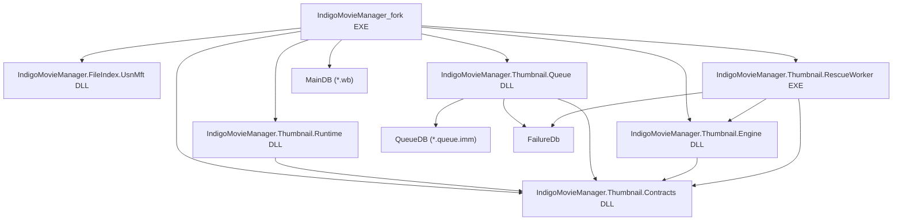
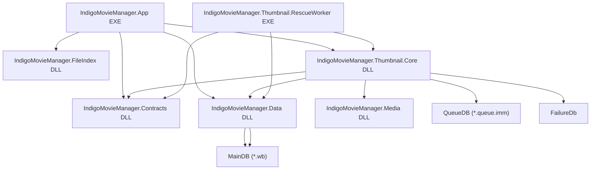

# 人間向け 大粒度フロー DBとプロジェクト 現状と完成形 2026-03-20

最終更新日: 2026-03-20

変更概要:
- 人間向けに、DB とプロジェクトだけへ絞った大粒度フローを新規作成
- 現状の構成と、目指す完成形の構成を同じ粒度で並べて比較できるようにした
- クラス名や細かい処理順は省き、責務の置き場所だけ分かる資料にした

## 1. この資料の目的

- この資料は、今の構成を細部ではなく大づかみに理解するための入口である。
- ノードは「プロジェクト」と「DB」だけに限定する。
- クラス、フォルダ、メソッド、UIイベント単位の話は入れない。

## 2. 読み方

- 箱はプロジェクトか DB を表す。
- 矢印は「主に使う」「主に触る」「そこへ流す」を意味する。
- 正確な参照関係の完全図ではなく、人間が迷わないための大粒度図である。

## 3. 前提

- メイン DB は WhiteBrowser 互換の `*.wb` を正本とする。
- サムネイル通常キューは `*.queue.imm` を使う。
- rescue 系は `FailureDb` を使って失敗情報を保持する。
- 現状は分離が進んでいるが、まだ `IndigoMovieManager_fork` 本体が広い責務を持っている。

## 4. 現状の大粒度フロー

### 4.1 現状の見方

- `IndigoMovieManager_fork EXE` がまだ中心で、MainDB を開き、一覧表示、監視起動、サムネ起動、rescue 起動の入口をまとめて持っている。
- `IndigoMovieManager.FileIndex.UsnMft DLL` は、監視や差分抽出の補助役として本体から使われる。
- サムネ系は `Contracts`、`Runtime`、`Queue`、`Engine`、`RescueWorker` まで分離済みだが、呼び出しの主導権はまだ本体 EXE 側に大きく残っている。
- `Queue DLL` は通常サムネの流れを持ち、`QueueDB (*.queue.imm)` を読む。
- rescue 系は `FailureDb` を使い、`RescueWorker EXE` が失敗情報を見て再挑戦する。

### 4.2 現状の要点

1. 良い点は、重い処理が既に別プロジェクトへ逃がされ始めていること。
2. まだ重い点は、本体 EXE が DB と各 DLL の調停役を広く持っていること。
3. 人が迷いやすい点は、サムネ系の分離は進んだが「どこが本当の中心か」が見えにくいこと。

## 5. 完成形の大粒度フロー

この「完成形」は、既存の DLL 分離方針を人間向けに丸めた将来像である。
今あるプロジェクト名と完全一致させることよりも、責務がどう揃うかを優先している。

### 5.1 完成形の見方

- `IndigoMovieManager.App EXE` は UI の殻に近づき、画面制御と起動制御へ責務を絞る。
- DB へ直接触る中心は `IndigoMovieManager.Data DLL` に寄せる。
- 通常サムネと rescue の流れは `IndigoMovieManager.Thumbnail.Core DLL` へ寄せる。
- 動画解析やデコードの実装は `IndigoMovieManager.Media DLL` に寄せる。
- `Contracts DLL` は各プロジェクトが共有する契約だけを持つ。
- `RescueWorker EXE` は本体の分身ではなく、共通コアを使う別ホストになる。

### 5.2 完成形の要点

1. App が薄くなる。
2. DB 入口が Data に寄る。
3. サムネの判断と進行が Core に寄る。
4. デコード実装が Media に閉じる。
5. rescue も本体専用ロジックではなく、共通コアを使う形へ揃う。

## 6. 現状と完成形の違い

| 観点 | 現状 | 完成形 |
|---|---|---|
| 本体 EXE | 調停役を広く持つ | UI と起動制御へ絞る |
| MainDB 入口 | 本体から直接触る比率が高い | Data に寄せる |
| サムネ通常系 | Queue / Runtime / Engine に分散 | Core に判断を寄せる |
| rescue 系 | 本体と worker で責務が跨りやすい | worker は共通コア利用へ揃う |
| 契約 | 分離済みだが活用拡大中 | 全体の共通境界として固定 |

## 7. 人間向けのざっくり解説

### 7.1 いま何が起きているか

- 既にプロジェクト分離はかなり進んでいる。
- ただし「本体が賢すぎる状態」はまだ残っている。
- そのため、コードを追う時に「UIの話」と「サムネ処理の話」と「DBの話」が本体 EXE へ戻りやすい。

### 7.2 これからどこへ寄せたいか

- MainDB への入口は Data へ寄せる。
- サムネ通常系と rescue 系の流れは Core へ寄せる。
- 動画エンジン実装は Media へ寄せる。
- App は UI shell として軽くする。

### 7.3 この資料の使いどころ

- 新しい人が「今どこが中心か」を掴む時
- 大きいリファクタの影響範囲を会話する時
- 変更案が「現状寄り」か「完成形寄り」かを判断する時

## 8. 関連資料

- `Docs\Architecture_2026-02-28.md`
- `Docs\DatabaseSpec_2026-02-28.md`
- `Docs\Architecture_DLL_Separation_Plan_2026-03-02.md`
- `AI向け_現在の全体プラン_2026-04-07.md`
