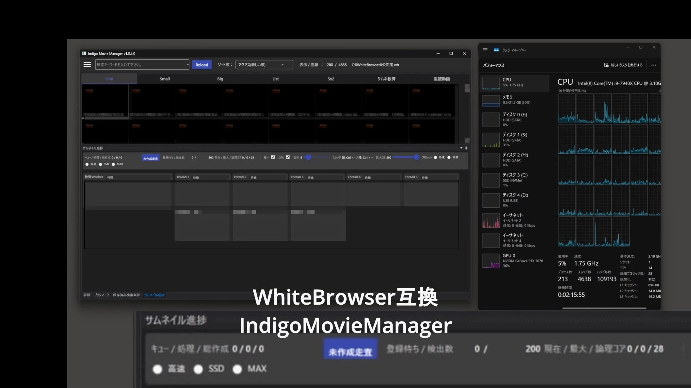

# IndigoMovieManager

最終更新日: 2026-04-01

IndigoMovieManager は、WhiteBrowser 互換を重視した動画管理アプリです。
動画一覧の管理、検索、監視フォルダからの取り込み、サムネイル生成をまとめて扱えます。

## 最近の更新

- 2026-04-01 UNC/NAS対応
  UNC/NAS 上の DB や監視フォルダを、これまでより安心して扱えるよう整理しました。

- 2026-03-29 D&D対応
  WhiteBrowser の `*.wb` と画像フォルダのドラッグ＆ドロップに対応しました。DB 未選択時は、フォルダのドロップで新しい DB 作成へ進めます。

## このアプリでできること

- `*.wb` を開いて動画一覧を使えます
- 監視フォルダから動画を取り込めます
- サムネイルを自動で作成できます
- `*.wb` をメイン画面へドラッグ＆ドロップして開けます
- DB 未選択時は、動画フォルダをドラッグ＆ドロップして新しい DB 作成へ進めます

## ダウンロード

- Releases:
  https://github.com/T-Hamada0101/IndigoMovieManager_fork/releases
- 初めて使う方向けの手順:
  Docs/forHuman/簡単マニュアル_ReleaseAssetsからダウンロードして使い始めるまで_2026-03-29.md

## 使い始め方

1. Release の `Assets` からアプリ本体 ZIP をダウンロードします。
2. ZIP を展開します。
3. `IndigoMovieManager_fork_workthree.exe` を起動します。
4. 既存の `*.wb` を使うか、動画フォルダをドロップして新しい DB を作成します。

## WhiteBrowser から移行する方へ

- 元の WhiteBrowser DB を直接使わず、必ずコピーした `*.wb` を使ってください
- 既存 DB を使う時は、その `*.wb` をメイン画面へドラッグ＆ドロップすると開けます
- 新しく始める時は、動画フォルダをメイン画面へドラッグ＆ドロップしてください

詳しい注意点:
Docs/Gemini/Migration_from_WhiteBrowser_Notes_2026-03-25.md

## 動作に必要なもの

- Windows
- `.NET 8 Desktop Runtime`

利用だけなら `.NET 8 Desktop Runtime` があれば動きます。

## 配布内容

- アプリ本体
- 必要な DLL
- `rescue-worker`

`rescue-worker` はアプリ本体 ZIP の中に同梱されています。

## 困った時

- 起動しない時は `.NET 8 Desktop Runtime` の有無を確認してください
- 使い始め方は次の手順書を確認してください
  Docs/forHuman/簡単マニュアル_ReleaseAssetsからダウンロードして使い始めるまで_2026-03-29.md

## 開発者向け情報

開発向け README は次を見てください。

- README_2026-03-28.md
