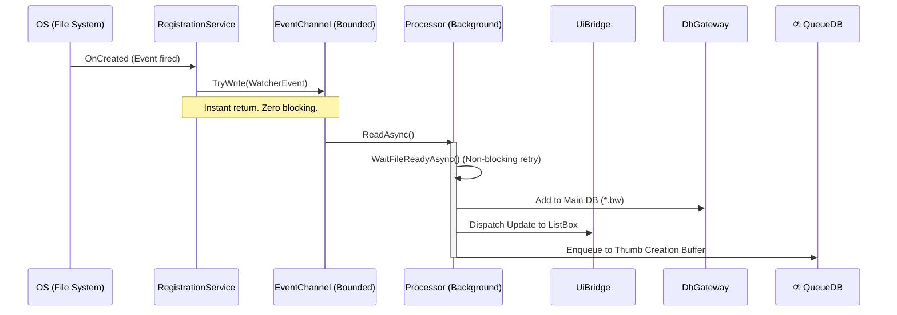

# Watcherアーキテクチャ詳細設計（生産者プレーン）

## 1. 概要
`Watcher` コンポーネントは、本アプリの完全非同期キューアーキテクチャにおける**「① 生産者 (Producer)」**の役割を担います。
既存の `MainWindow.Watcher.cs` に存在していた「同期待機 (`Thread.Sleep`)」「同期的なDB登録」「直接的なUI操作」といった密結合とブロッキング要因をすべて排除し、システム全体の応答性を最大化することを目的としています。

このアーキテクチャは、`FileSystemWatcher` が発火したイベントを極めて軽量に受け取り、バックグラウンドのワーカースレッドへ安全に受け渡す **Producer-Consumer パターン (Channelベース)** を採用しています。

## 2. ゴールと設計原則
- **Zero Blocking**: `FileSystemWatcher` のイベントハンドラ内では一切の I/O (DBアクセス、ファイルアクセス待機) を行わず、DTo(`WatcherEvent`) を投げ込んで即座にリターンする。
- **デバウンス（重複排除）**: OSから連続して発火する同一ファイルのイベント（作成やサイズ変更など）を吸収し、後段のDB処理やサムネイル処理への負荷を抑える。
- **責務の完全分離**: 
  - イベントの検知 (`WatcherRegistrationService`)
  - キューイングと中継 (`WatcherEventChannel`)
  - イベントの解釈と永続化への橋渡し (`WatcherEventProcessor`, `WatcherDbGateway`)
  - UIへの通知 (`WatcherUiBridge`)

## 3. コンポーネント構成と役割

### 3.1 `WatcherEvent` (データ転送オブジェクト)
- **役割**: `FileSystemWatcher` から得られた生の情報を保持するイミュータブルなレコードまたはクラス。
- **保持データ**: イベント種別 (Created, Renamed, Deleted)、対象のファイルパス、旧ファイルパス (Renamed時)、発生時刻。

### 3.2 `WatcherRegistrationService` (監視ライフサイクル管理)
- **役割**: `FileSystemWatcher` インスタンスの生成、設定、破棄を管理する。
- **動作**: 
  - `MainWindow` の起動・終了や、監視フォルダ設定の変更に合わせて動作を制御する。
  - OSから発火したネイティブなイベントを受け取り、`WatcherEvent` オブジェクトに変換して `WatcherEventChannel` へ書き込む（`TryWrite`）。この処理は極めて軽量（数マイクロ秒）で終わる。

### 3.3 `WatcherEventChannel` (イベント用インメモリ・バッファ)
- **役割**: 生産者（OSイベント）と消費者（Processor）をスレッドセーフに繋ぐパイプライン。
- **実装**: `.NET` 標準の `System.Threading.Channels.Channel<WatcherEvent>` を使用する。
  - 大量コピー等でのメモリ枯渇を防ぐため、上限枠付きの `BoundedChannel` を採用し、溢れた場合は「古いイベントを捨てる」などの戦略（または Drop ログ出力）を取ることを推奨。（要検証）

### 3.4 `WatcherEventProcessor` (非同期イベント消化エンジン)
- **役割**: Channel から流れてくるイベントを非同期で取り出し、実際のビジネスロジック（ファイル準備確認、DB登録、キュー追加）を統括する。
- **動作**:
  - `Task.Run` 等で常駐するバックグラウンドループとして稼働。
  - `Created` イベント受信時:
    1. **準備待機**: `WatcherFileReadyChecker.WaitFileReadyAsync` を await し、ファイルシステム側のコピー完了（ロック解除）を CPU をブロックせずに待つ。
    2. **DB登録**: `WatcherDbGateway` を介してメインDB(`*.bw`) へ対象動画を追加。
    3. **UI反映**: `WatcherUiBridge` へ通知し、画面のリストを更新する。
    4. **サムネイル予約**: 対象が動画ファイルであれば、サムネイル生成用バッファ（※② `QueueDB` の追加バッファ）へエンキューする。
  - `Renamed` イベント受信時は、旧パスから新パスへのDB更新と、UI/キューへの反映変更ロジックを非同期で実行する。

### 3.5 補助・境界コンポーネント
- **`WatcherFileReadyChecker` (非同期リトライ制御)**
  - 古い `Thread.Sleep` の代替。`await Task.Delay` と非同期ロック判定を用い、コピー完了などをスマートに待機する。最大リトライ回数を超えた場合はログを残して破棄する。
- **`WatcherDbGateway` (DBアクセス隔離)**
  - 現状の SQLite プロバイダが同期処理主体であることを考慮し、`Task.Run` でラップするなどして I/O スレッドプールの枯渇や Processor のブロックを防ぐ。同時並行数を `SemaphoreSlim` 等で制限し、SQLite ファイルへのロック競合（`database is locked`）を回避する。
- **`WatcherUiBridge` (UIスレッド境界)**
  - ワーカースレッドから直接 `ObservableCollection` を操作するのを防ぐ。`Dispatcher.InvokeAsync` を用いた明示的な UI スレッドへのコンテキストスイッチをここで一本化する。

## 4. イベント処理フロー図（概念）

## 5. エラーハンドリングとキャンセル
- 各イベントの処理ループ（`Processor` 内）は `try-catch` で厳密に保護され、1つの問題ファイル（例: 壊れた動画、永続的なロック）が監視ループ全体のタスククラッシュを引き起こさないようにする。
- アプリケーション終了時は、`CancellationToken` を通じて `Processor` のメインループへキャンセルを通知し、安全にタスクを終了させる。未処理の QueueEvent はアプリ仕様として破棄（次回起動時に再スキャン）するか検討する。
