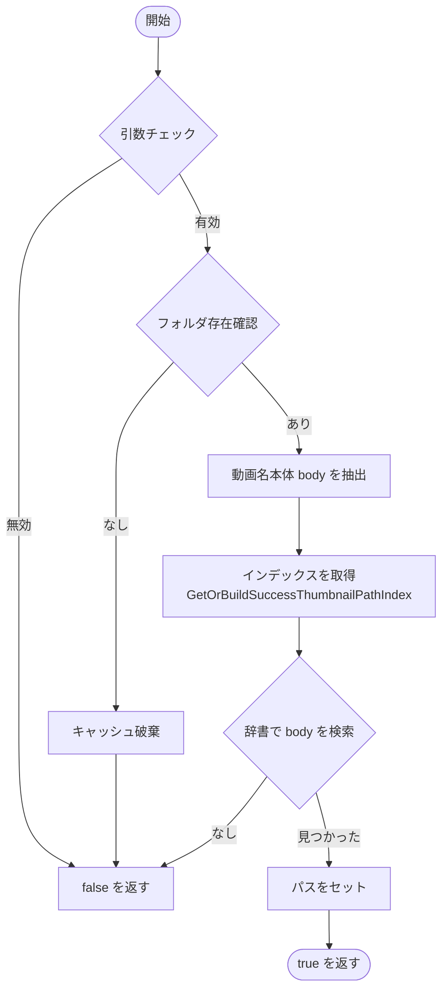
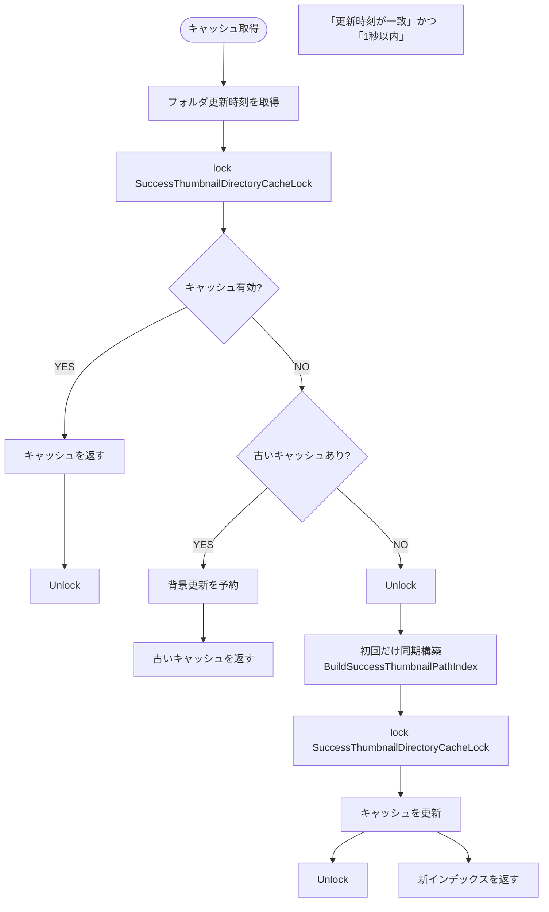
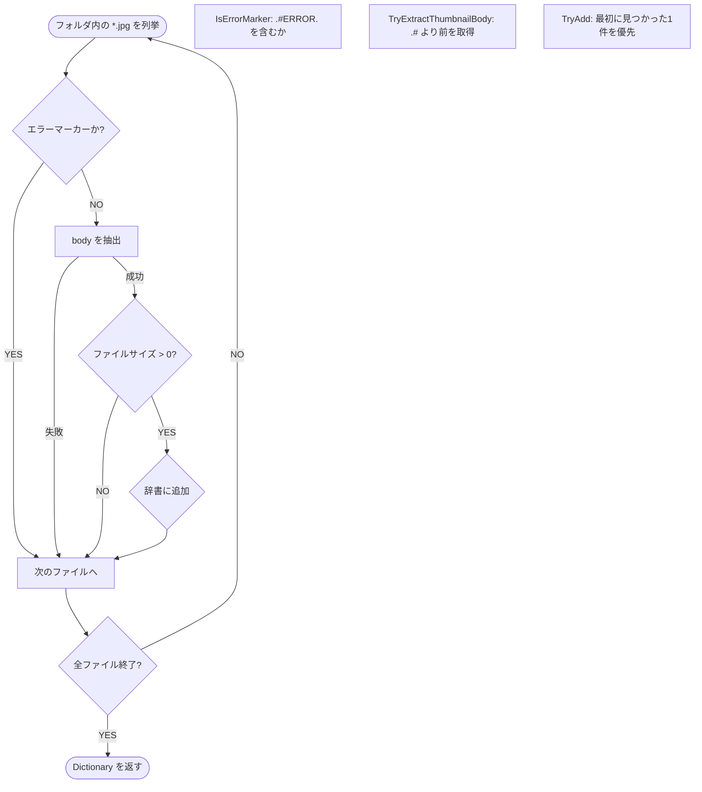
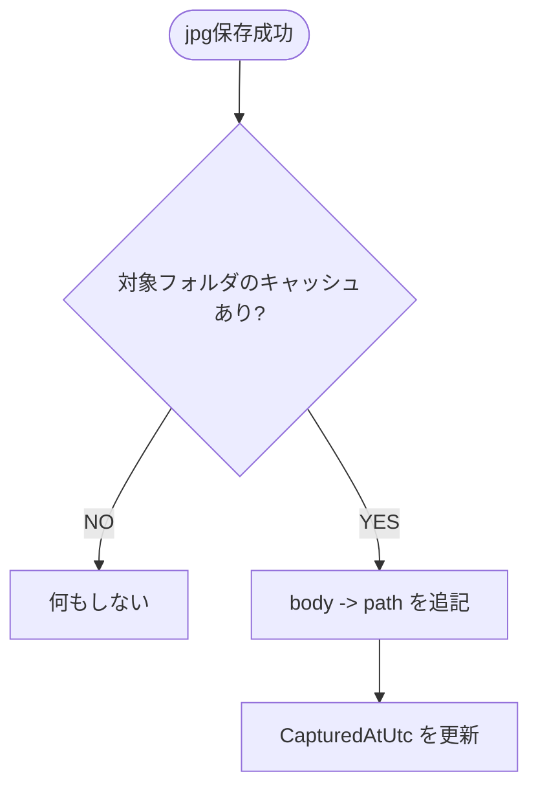
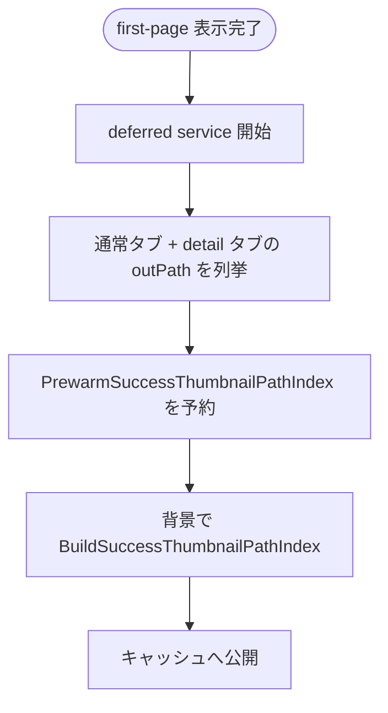
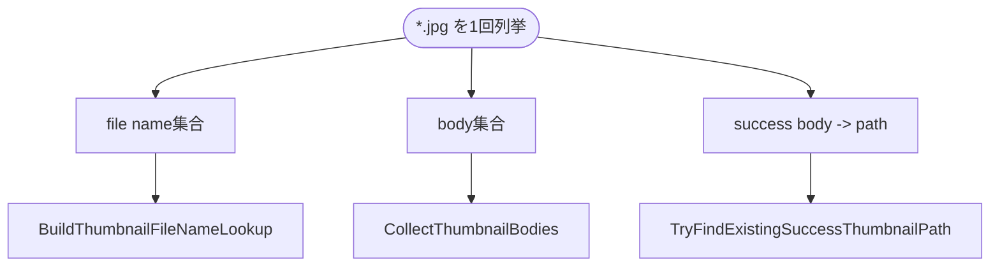

# サムネイル検索ロジックのフロー図 (2026-03-19)

最終更新日: 2026-03-19

変更概要:
- `GetOrBuildSuccessThumbnailPathIndex` を stale-while-revalidate 化
- 古いキャッシュを即返ししつつ、背景でインデックス再構築する流れへ更新
- 本exeで保存成功したjpgをキャッシュへ即反映する経路を追記
- 起動後の deferred service で各タブ outPath をプリウォームする経路を追記
- 一度の列挙から file name集合 / body集合 / success辞書を共用するよう更新

`ThumbnailPathResolver` がどのように既存の正常なサムネイルを見つけ出し、無駄な再生成やエラーマーカーの新設を防いでいるかをまとめる。

## 全体フロー: TryFindExistingSuccessThumbnailPath

このメソッドは、指定された動画の「正常なサムネイル」が既に出力フォルダにあるかを確認する入口である。

---

## キャッシュ戦略: GetOrBuildSuccessThumbnailPathIndex

フォルダの全走査は重い。そこで短時間キャッシュ（TTL 1秒）とフォルダ更新時刻チェックを組み合わせつつ、古いキャッシュがある場合は即返しして背景更新へ逃がす。

---

## インデックス構築: BuildSuccessThumbnailPathIndex

実際のファイル列挙とフィルタリングの中心処理である。

---

## 保存成功時の即時反映

本exeでjpg保存に成功した時は、そのパスをキャッシュへ即反映する。これにより、直後の ERROR 抑止判定や stale cleanup で再走査を減らせる。

---

## 起動後プリウォーム

first-page 表示後の deferred service で、各タブの outPath をバックグラウンドでプリウォームする。これにより、初回の `TryFindExistingSuccessThumbnailPath` が同期全走査に落ちる頻度を下げる。

---

## 共有スナップショット

同じ outPath に対しては、1回の `*.jpg` 列挙から次の3種類をまとめて持つ。

1. success 判定用の `body -> full path`
2. 一覧表示用の file name 集合
3. EverythingLite 互換の body 集合

これにより、`BuildThumbnailFileNameLookup` と `CollectThumbnailBodies` の追加列挙を避ける。

---

## まとめ

この仕組みで次を両立する。

1. UI 主経路では古いキャッシュでも即返しし、全走査待ちを避ける
2. エラーマーカー（`#ERROR`）を無視して、本物の成功画像だけを探す
3. 0バイトの壊れた画像を除外し、安全性を維持する
4. 本exe保存分は即反映し、無駄な再走査を減らす
5. 起動後に主要 outPath をプリウォームし、初回ミス時の同期走査を減らす
6. file name / body / success 判定のために同じフォルダを何度も列挙しない
