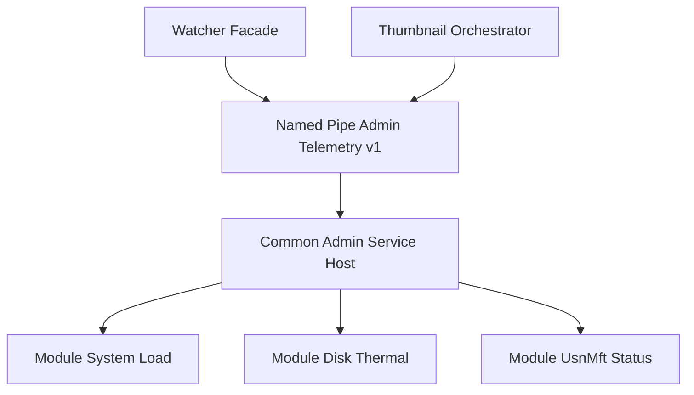

# 設計メモ: 共通管理者権限サービス基盤方針（2026-03-07）

## 1. 目的
- `AdminUsnMft` とサムネイル高負荷検知を、別々の昇格サービスへ分裂させない方針を固定する。
- `Watcher` とサムネイルが同じ管理者権限サービス基盤を共有する時の構成を、先に迷いなく説明できるようにする。

## 2. 結論
- 管理者権限サービスは `AdminTelemetry` の **単一ホスト** に固定する。
- `UsnMft Status`、`Disk Thermal`、`System Load` は、その単一ホスト配下の **モジュール** として扱う。
- `Watcher` とサムネイルは、同じ `IndigoMovieManager.AdminTelemetry.v1` pipe へ接続する。
- したがって、`AdminUsnMftService` と `ThumbnailThermalService` のような別名・別pipe・別昇格経路は作らない。

## 3. 構成図

## 4. 単一ホスト化の理由
- 昇格経路が1つに集約され、インストール・起動・監視の運用が単純になる。
- `Watcher` とサムネイルで権限取得方法やログの意味が食い違いにくい。
- `UsnMft` と `DiskThermal` はどちらも「特権付き情報取得」であり、責務の性質が同じである。
- pipe 名、タイムアウト、接続監視を共通化できる。

## 5. モジュール境界
- `Module UsnMft Status`
  - `Watcher` 向けの `AdminUsnMft` 状態取得を担当する。
- `Module Disk Thermal`
  - サムネイル高負荷検知向けのディスク温度取得を担当する。
- `Module System Load`
  - CPU、I/O、メモリ圧迫など、全体負荷の補助シグナル取得を担当する。
- どのモジュールも「取得結果を返す」だけに留め、縮退判断やUI通知は持たない。

## 6. クライアント側の整理
- `Watcher`
  - `FileIndexProviderFacade` を維持する。
  - プロバイダ選択、fallback、通知文言は従来どおりホスト側責務に残す。
- `Thumbnail`
  - `HighLoadScore` 計算、縮退・復帰、ログ分類は従来どおりオーケストレータ責務に残す。
- 共通契約
  - `src/IndigoMovieManager.Thumbnail.Queue/Ipc/AdminTelemetryContracts.cs` の `AdminTelemetryConsumerKind` で、`ThumbnailOrchestrator` と `WatcherFacade` の両方を表せるようにする。

## 7. 移行方針
- 現在の `AdminUsnMftIndexBackend` は直ちに削らず、将来の共通サービスホストへ移設できる単位として扱う。
- `Watcher` 側は一気に作り替えず、Facade を維持したまま背後の取得経路だけを共通サービスへ差し替え可能にする。
- サムネイル側は `AdminTelemetry` 契約に沿って段階的に接続する。

## 8. ここで決めないこと
- サービス実装プロジェクト名
- サービスのインストーラ方式
- `AdminUsnMftIndexBackend` をいつ完全移設するか
- `LTH-020` 以降で実装する未接続時フォールバック詳細

## 9. 受け入れ基準
- `UsnMft` と `Disk Thermal` で別サービスを作らない方針が明文化されている。
- `Watcher` とサムネイルが同じ pipe を使う前提が図と文章の両方で説明できる。
- クライアント責務とサービス責務が混ざっていない。
