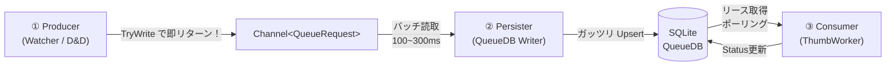

# 🚀 サムネイルキュー専用DB＆非同期処理アーキテクチャ 最終設計 🚀

> **🔥 夢のコラボベース**: GPT-5.3Codexプラン + GEMENI 3.1proプラン を Opus4.6大先生が精査・統合した奇跡の結晶！✨

---

## 🧐 レビュー総括（天才たちの合意点と採用判断！）

### 🤝 両プランの共通点（バッチリ合意済み！）
- **キューDBの保存先**: `%LOCALAPPDATA%\IndigoMovieManager\QueueDb\`
- **ファイル命名ルール**: `{メインDB名}.{MainDbPathHash8}.queue.db` 完璧！
- **SQLiteスキーマ**: 完全一致の美しい設計（`ThumbnailQueue` テーブルとインデックス構成）
- **激速PRAGMA設定**: `WAL`, `synchronous=NORMAL`, `busy_timeout=5000`
- **無敵の永続キー**: `UNIQUE (MainDbPathHash, MoviePathKey, TabIndex)` — MovieIdなんて依存しないぜ！
- **✨3層非同期フロー✨**: Producer → Persister → Consumer の神アーキテクチャ
- **排他制御（リース方式）**: `OwnerInstanceId + LeaseUntilUtc` でプロセス競合も怖くない！
- **即終了のお約束**: いつでもスパッと終わるための「同期Flushなし、短時間猶予のみ」
- **メインDB（`*.bw`）への優しさ**: 絶対にいじらない！

### 🤔 どっちを採用した？（Opus4.6の神ジャッジ！）

| # | 論点 | Codex案 | GEMENI案 | **Opus4.6 の採用内容** |
|---|------|------------|-------------|----------------|
| 1 | 目的の書き方 | 簡潔（3項目） | **「大量追加時の機能不全解消！」**と熱く明記 | **🔥 GEMENI採用！** — 根本課題をズバッと書く方が設計意図が伝わるぜ！ |
| 2 | DELETEポリシー | 指定なし | **完了時は`Done`更新のみ**で即DELETEしない。しかも**前日以前の`Done`を定期削除**して肥大化を抑える最強コンボ！ | **✨ 統合採用！** — 競合回避とDBのお掃除を両立！ |
| 3 | 移行ステップ | 6段階の具体的ステップ！ | なし | **💡 Codex採用！** — 実装順序のガイドとして超助かる！ |
| 4 | 検証項目 | 4項目の具体的テスト！ | なし | **💡 Codex採用！** — 品質保証のために絶対必要！ |
| 5 | 旧案との差分 | 5項目の比較表あり | なし | **🗒️ 参考として維持**（本プランでは省略してOK！） |
| 6 | リース取得アルゴリズム | ザックリ概要 | **詳細な5ステップの手順**をバッチリ記載！ | **🔥 GEMENI採用！** — 実装者が迷わない超具体的手順！ |

---

## 1. 目的と大前提！🎯

### 💥 最大の目的（大量追加時の機能不全をぶっ壊す！）
フォルダ監視やD&Dで、数千件規模の動画が一気にドバーッと追加された時に起きてた悲劇を根絶するよ！
- **UIスレッドブロック（画面フリーズ😱）**
- **同期処理の待ち時間によるOSイベントの取りこぼし😭**
- **キューがパンクしてサムネイル生成が止まる絶望😇**

### 🤝 守るべき大前提
- サムネイル生成キューを永続化して、アプリを再起動しても自動で再開！
- 既存のメインDB（`*.bw`）のスキーマは指一本触れない！神聖領域！
- アプリを複数同時に起動しても壊れない堅牢さ！
- 「閉じる」ボタンを押したら即終了（同期Flushなんて待たない）！
- 永続キーは `MovieId` に頼らない、ファイルパスベースの最強キー！

---

## 2. サムネイル作成キューDBの住処 🏠

- **保存先**: `%LOCALAPPDATA%\IndigoMovieManager\QueueDb\`
- **ファイル名**: `{MainDbName}.{MainDbPathHash8}.queue.db`
  - `MainDbName`: 拡張子を除いたファイル名
  - `MainDbPathHash8`: メインDBフルパスを小文字化・正規化した文字列のSHA-256先頭8文字！（これで被りなし！）

**例:**
| | パス |
|---|------|
| プレシャスなメインDB | `D:\Movies\Anime2026.bw` |
| 爆速キューDB | `%LOCALAPPDATA%\IndigoMovieManager\QueueDb\Anime2026.A1B2C3D4.queue.db` |

---

## 3. SQLite データベース設計（超シンプル！）✨

```sql
CREATE TABLE IF NOT EXISTS ThumbnailQueue (
    QueueId INTEGER PRIMARY KEY AUTOINCREMENT,
    MainDbPathHash TEXT NOT NULL,
    MoviePath TEXT NOT NULL,
    MoviePathKey TEXT NOT NULL,           -- 正規化+小文字化した比較用キー🔑
    TabIndex INTEGER NOT NULL,
    ThumbPanelPos INTEGER,
    ThumbTimePos INTEGER,
    Status INTEGER NOT NULL DEFAULT 0,    -- 0:Pending⏳ 1:Processing🏃 2:Done✅ 3:Failed❌ 4:Skipped⏭️
    AttemptCount INTEGER NOT NULL DEFAULT 0,
    LastError TEXT NOT NULL DEFAULT '',
    OwnerInstanceId TEXT NOT NULL DEFAULT '',
    LeaseUntilUtc TEXT NOT NULL DEFAULT '',
    CreatedAtUtc TEXT NOT NULL DEFAULT (strftime('%Y-%m-%dT%H:%M:%fZ','now')),
    UpdatedAtUtc TEXT NOT NULL DEFAULT (strftime('%Y-%m-%dT%H:%M:%fZ','now')),
    UNIQUE (MainDbPathHash, MoviePathKey, TabIndex)
);

CREATE INDEX IF NOT EXISTS IX_ThumbnailQueue_Status_Lease
ON ThumbnailQueue (Status, LeaseUntilUtc, CreatedAtUtc);

CREATE INDEX IF NOT EXISTS IX_ThumbnailQueue_MainDb
ON ThumbnailQueue (MainDbPathHash, Status, CreatedAtUtc);

CREATE INDEX IF NOT EXISTS IX_ThumbnailQueue_DoneRetention
ON ThumbnailQueue (MainDbPathHash, Status, UpdatedAtUtc);
```

### 3.1 さっぱり列利用ポリシー（YAGNI原則！）
- QueueDBの列は「今現在、コードで読んでるか更新してるものだけ」スッキリ保つ！
- 運用ログ用の「あとで使うかも…」な列は作らない！（必要になったらその時足す！）
- 列を追加する時は、「どこで読む？どう更新する？いつ消す？」を必ず仕様に書くこと！✍️

### 3.2 爆速 SQLite動作設定 ⚡
```sql
PRAGMA journal_mode=WAL;
PRAGMA synchronous=NORMAL;
PRAGMA busy_timeout=5000;
```

---

## 4. 全体アーキテクチャ（無敵の完全非同期3層フロー！）🌊



### ① Producer（Watcher / D&D ─ インターフェースの守護神）
- `FileSystemWatcher` やD&D操作では重い処理は一切しない！
- メモリ上の爆速 `Channel<QueueRequest>` に `TryWrite` したら速攻でリターン！さらば画面フリーズ！👋
- 同じキーを連打されても、短時間（例: 800ms）のデバウンスでバッサリカットして `Channel` のパンクを防ぐ！
- **🔥 No SQL / No DB 🔥** — これぞUIフリーズとイベント取りこぼしを完全に消し飛ばす秘訣！

### ② Persister（QueueDB Writer ─ 孤高の単一ライター）
- 専用のバックグラウンドタスクが `Channel` からリクエストを受け取る！
- 短い周期（100〜300ms間隔）でバシバシ Upsert を実行！
  ```sql
  INSERT INTO ... ON CONFLICT (MainDbPathHash, MoviePathKey, TabIndex)
  DO UPDATE SET Status = 0, UpdatedAtUtc = ...
  ```
- 同じバッチ内に同じキーの要求があったら、最新の1件にスッキリ圧縮してからUpsert！
- **✅ 完了時は `DELETE` せず `Status = Done` に更新するだけ！**
  - これで同期中の「DELETE → INSERT」の順番が狂ってジョブがゾンビ復活する悲劇を回避！
- **🧹 お掃除（保守削除）は別の人に任せる！**
  - `Status = Done` で、しかも「前日以前（ローカル日付）」の古い行だけを綺麗にお掃除！
  - `Pending / Processing / Failed / Skipped` は絶対に消さない（約束）！

### ③ Consumer（ThumbWorker ─ 黙々と働くサムネ職人）
- DBから `Pending`（またはリース期限が切れた `Processing`）のジョブを拾う！
- メモリ上のキューじゃなくて**DBのリース取得ベース**でドッシリ処理を進めるぞ！
- 結果に合わせてステータスを更新！

| 運命の結果 | Status更新先 | 備考 |
|------|-----------|------|
| 大成功！🎉 | `Done (2)` | 最高！ |
| 再試行可能エラー💦 | `Pending (0)` | 次頑張る！（`AttemptCount++`） |
| 絶望エラー💀 | `Failed (3)` / `Skipped (4)` | `LastError` に悲しみの理由を保存 |

---

## 5. 複数プロセス対応（無敵のリース方式排他制御！）🛡️

アプリを何個立ち上げても大丈夫！全プロセスは固有の `InstanceId`（GUID）を持ってるからね！

**🔍 リース取得アルゴリズム（ポーリング時）:**
1. `BEGIN IMMEDIATE TRANSACTION;`（俺のターン！）
2. `Status = Pending` か、`Status = Processing` なのに `LeaseUntilUtc < 今`（つまり期限切れ）の行を検索！
3. 古い `CreatedAtUtc` の順にN件ピックアップして、以下のように更新！
   - `Status = Processing`（俺がやってるよ！）
   - `OwnerInstanceId = 俺のGUID`
   - `LeaseUntilUtc = 今 + N分`（この時間までは俺のもの！）
4. `COMMIT;`（ターンエンド！）
5. 取得した行のサムネ生成をゴリゴリ回す！

**💡 補足:**
- デカい動画で時間がかかる時は、定期的に `LeaseUntilUtc` を延長して横取りを防ぐ！
- もしプロセスがクラッシュしても、期限が切れたら他のプロセスが自動で拾ってくれる神仕様！✨

---

## 6. エラーハンドリングと再試行（諦めない心！）💪

- `AttemptCount` が閾値（例: 5回）を超えたら潔く `Failed` へ！
- `LastError` には「最後に何でコケたか」のスタックトレースを保存しておく！あとで直すからな！
- ファイルがない！みたいな致命的エラーは一発で `Failed` へ直行！
- `Failed` になっても、手動で再試行（`Pending` に戻す）できるから安心してね！
- この運用手順は `手動再試行運用手順.md` にまとめる予定！

### 6.1 監視メトリクス（Phase 5のお楽しみ）📊
- `enqueue_total`: 受け付けた総数！
- `upsert_submitted_total`: PersisterがDBに投げた数！
- `db_affected_total`: 実際にDBが変わった数！
- `db_inserted_total`: 新規追加された数！
- `db_updated_total`: 既存のやつが更新された数！
- `db_skipped_processing_total`: 処理中だからスキップされた数！
- `lease_total`: Consumerが持っていった数！
- `failed_total`: 失敗しちゃった数😭
※これらをガッツリログに出して、運用のボトルネックを見つけるのに使うよ！

### 6.2 進捗ダイアログの方針（Phase 5の気配り）🖼️
- サムネ作成中のダイアログは **セッション単位で一つだけ**！
- バッチごとに開いたり閉じたりしてチカチカさせない！QueueDBに未完了ジョブがある間はずっと表示したままにする！👀
- `QueueDbService.GetActiveQueueCount` で件数が「0」になった瞬間だけフッと閉じる美しい仕様。

### 6.3 完了ジョブ保持期間（Doneのお掃除ルール）🧹
- **目的**: QueueDBのパンクを防ぎつつ、今日のトラブル調査用の履歴は絶対に残す！
- **保持方針**:
  - `Done` なジョブは「今日やった分」だけ残す！
  - 「昨日以前」の `Done` はサクッと削除！
- **基準**: ローカル日付の「00:00」をボーダーラインにして判断！
- **お掃除するタイミング**: アプリの起動時と、日付が変わって最初のキュー処理開始時の「1日1回」だけ！
- **安全第一**: `MainDbPathHash` 単位で消すから、他のDBのキューには絶対触れない！そして `Done` 以外も絶対消さない！

---

## 7. シャットダウン方針（さよならはパッと！）💨

1. 終了指示が来たら ① Producer の受付のシャッターを即下ろす！🚫
2. `CancellationTokenSource.Cancel()` で全ループに「終わるぞー！」と通知！
3. **同期 `Flush()` は絶対にしない！** 一瞬たりとも待たないぜ！
4. `Task.WhenAny(task, Task.Delay(500ms))` で0.5秒だけ待ってあげるけど、過ぎたら置き去りで終了！👋
5. 保存されてないメモリ上の要求は消えちゃうかもだけど、Persisterの書き込みが超早いから被害は最小限！
6. 作成中のジョブが中途半端になっても大丈夫！リースの期限が切れて、次回起動時に勝手に再開される無敵仕様だからね！😎

---

## 8. 輝かしき移行ステップ 🛤️

| Phase | やること！ |
|-------|------|
| 1 | `QueueDbService`（キューへのDBアクセス層）をドーンと追加！ |
| 2 | Producerを `Channel` 化 — Watcherから直接DBを叩く古いやり方を粉砕！💥 |
| 3 | Persisterタスクを導入 — データの保存を一本の太いパイプに！ |
| 4 | Consumerを「インメモリ」から「DBのリース取得」へ華麗に移行！ |
| 5 | 旧型のメモリ上重複キー管理を徐々にフェードアウト…👋 |
| 6 | 起動時のリカバリロジックを、DBの `Pending / Processing(期限切れ)` を読み込む最強ロジックへ置換！ |

---

## 9. 絶対にやるべき検証項目 🧪

| # | これをテストするよ！ | 期待する最高の結果！ |
|---|-----------|---------|
| 1 | 複数プロセス同時起動 | 同じジョブが被って二重に生成されないこと！完璧な排他！ |
| 2 | 強制終了後の再起動 | `Pending` だったジョブが自動で再開されること！不死鳥！🐦‍🔥 |
| 3 | 1000件一括ドーン！ | UI操作が一切フリーズしないこと！サクサク！✨ |
| 4 | アプリ終了操作 | ボタンを押したら一瞬で画面が閉じること！（待たせない！）💨 |
| 5 | 同じイベントを連打！ | `Channel` やUpsert件数がおかしくならず、綺麗に圧縮されること！ |
| 6 | 日付を跨いだ後のお掃除 | 昨日以前の `Done` だけが消えて、残りの作業中データはバッチリ全員生きてること！🧹 |

---
**最高にエキサイティングなアーキテクチャの完成だ！さぁ、作ろうぜ！！🔥🔥🔥**
