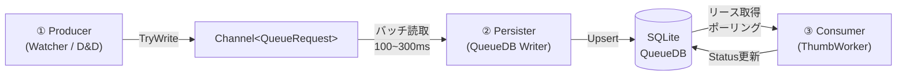

#  サムネイルキュー専用DB＆非同期処理アーキテクチャ 最終設計

> **ベース**: GPT-5.3Codexプラン +GEMENI 3.1proプラン をOpus4.6が精査・統合

---

## レビュー総括

### 両プランの共通点（合意済み事項）
- キューDBの保存先: `%LOCALAPPDATA%\IndigoMovieManager\QueueDb\`
- ファイル命名: `{MainDbName}.{MainDbPathHash8}.queue.db`
- SQLiteスキーマ: 完全一致（`ThumbnailQueue` テーブル、インデックス構成）
- PRAGMA設定: `WAL`, `synchronous=NORMAL`, `busy_timeout=5000`
- 永続キー: `UNIQUE (MainDbPathHash, MoviePathKey, TabIndex)` — MovieId非依存
- 3層非同期: Producer → Persister → Consumer
- リース方式の排他制御: `OwnerInstanceId + LeaseUntilUtc`
- 即終了優先: 同期Flushなし、短時間猶予のみ
- メインDB（`*.bw`）は変更しない

### 差分と採用判断

| # | 論点 | Codex改訂版 | GAMENI改訂版 | **Opus46 採用** |
|---|------|------------|-------------|----------------|
| 1 | 目的の記述 | 簡潔（3項目） | **大量追加時の機能不全解消**を最大目的として明記 | **GAMENI採用** — 根本課題を明示する方が設計意図が伝わる |
| 2 | DELETEポリシー | 明示なし | **完了時は`Done`更新のみ**で即時DELETEしない。加えて**前日以前の`Done`を定期削除**して肥大化を抑制 | **統合採用** — 競合回避とDB保守を両立 |
| 3 | 移行ステップ | 6段階の具体的ステップ記載 | 記載なし | **Codex採用** — 実装順序のガイドとして不可欠 |
| 4 | 検証項目 | 4項目の具体的テスト記載 | 記載なし | **Codex採用** — 品質保証に必須 |
| 5 | 旧案との差分 | 5項目の変更比較表あり | 記載なし | **参考として維持**（本プランでは省略可） |
| 6 | リース取得アルゴリズム | 概要レベル | **詳細な5ステップの手順**を記載 | **GAMENI採用** — 実装者向けに具体的 |

---

## 1. 目的と前提要件

### 最大目的（大量追加時の機能不全解消）
監視フォルダやD&Dによって数千件規模の動画が一括追加された際に発生していた以下の機能不全を根絶する:
- UIスレッドブロック（フリーズ）
- 同期処理の待ち時間によるOSからのイベント取りこぼし
- キュー溢れによるサムネイル生成の停止

### 前提
- サムネイル生成キューを永続化し、再起動後に自動再開する
- 既存メインDB（`*.bw`）のスキーマは一切変更しない
- アプリの複数プロセス同時起動を許容する
- 即終了優先（同期Flushなし）
- 永続キーは `MovieId` に依存せず、ファイルパスベースとする

## 2. サムネイル作成キューDB配置

- **保存先**: `%LOCALAPPDATA%\IndigoMovieManager\QueueDb\`
- **ファイル名**: `{MainDbName}.{MainDbPathHash8}.queue.db`
  - `MainDbName`: 拡張子を除いたファイル名
  - `MainDbPathHash8`: メインDBフルパスを小文字化・正規化した文字列のSHA-256先頭8文字

**例:**
| | パス |
|---|------|
| メインDB | `D:\Movies\Anime2026.bw` |
| キューDB | `%LOCALAPPDATA%\IndigoMovieManager\QueueDb\Anime2026.A1B2C3D4.queue.db` |

## 3. データベース設計（SQLite）

```sql
CREATE TABLE IF NOT EXISTS ThumbnailQueue (
    QueueId INTEGER PRIMARY KEY AUTOINCREMENT,
    MainDbPathHash TEXT NOT NULL,
    MoviePath TEXT NOT NULL,
    MoviePathKey TEXT NOT NULL,           -- 正規化+小文字化した比較用キー
    TabIndex INTEGER NOT NULL,
    ThumbPanelPos INTEGER,
    ThumbTimePos INTEGER,
    Status INTEGER NOT NULL DEFAULT 0,    -- 0:Pending 1:Processing 2:Done 3:Failed 4:Skipped
    AttemptCount INTEGER NOT NULL DEFAULT 0,
    LastError TEXT NOT NULL DEFAULT '',
    OwnerInstanceId TEXT NOT NULL DEFAULT '',
    LeaseUntilUtc TEXT NOT NULL DEFAULT '',
    CreatedAtUtc TEXT NOT NULL DEFAULT (strftime('%Y-%m-%dT%H:%M:%fZ','now')),
    UpdatedAtUtc TEXT NOT NULL DEFAULT (strftime('%Y-%m-%dT%H:%M:%fZ','now')),
    UNIQUE (MainDbPathHash, MoviePathKey, TabIndex)
);

CREATE INDEX IF NOT EXISTS IX_ThumbnailQueue_Status_Lease
ON ThumbnailQueue (Status, LeaseUntilUtc, CreatedAtUtc);

CREATE INDEX IF NOT EXISTS IX_ThumbnailQueue_MainDb
ON ThumbnailQueue (MainDbPathHash, Status, CreatedAtUtc);

CREATE INDEX IF NOT EXISTS IX_ThumbnailQueue_DoneRetention
ON ThumbnailQueue (MainDbPathHash, Status, UpdatedAtUtc);
```

### 3.1 列利用ポリシー（未使用列を残さない）
- QueueDBの列は「現行コードで参照または更新しているものだけ」を保持する。
- 運用ログ目的の将来列を先行追加しない（必要になった時点で追加する）。
- 列追加時は、同時に「読み取り箇所」「更新箇所」「削除/保持ポリシー」を仕様へ明記する。

### 3.2 SQLite動作設定
```sql
PRAGMA journal_mode=WAL;
PRAGMA synchronous=NORMAL;
PRAGMA busy_timeout=5000;
```

## 4. 全体アーキテクチャ（完全非同期3層フロー）



### ① Producer（Watcher / D&D）
- `FileSystemWatcher` ハンドラやD&D操作では重い処理を行わない
- インメモリの `Channel<QueueRequest>` へ `TryWrite` するのみで即リターン
- 同一キー連打は短時間デバウンス（例: 800ms）で抑止し、`Channel` 膨張を防ぐ
- **No SQL / No DB** — UIフリーズとイベント取りこぼしを完全除去

### ② Persister（QueueDB Writer — 単一ライター）
- 専用バックグラウンドタスクで `Channel` から要求を受け取る
- 短周期バッチ（100〜300ms間隔）で Upsert 実行:
  ```sql
  INSERT INTO ... ON CONFLICT (MainDbPathHash, MoviePathKey, TabIndex)
  DO UPDATE SET Status = 0, UpdatedAtUtc = ...
  ```
- 同一バッチ内の同一キー要求（`MoviePathKey + TabIndex`）は最新1件へ圧縮してからUpsertする
- **完了時は `DELETE` せず `Status = Done` に更新のみ**
  - 同期中の DELETE → INSERT 順序競合によるジョブ復活問題を回避する
- **保守削除は別処理で実施**
  - `Status = Done` かつ「前日以前（ローカル日付基準）」の行のみを削除対象にする
  - `Pending / Processing / Failed / Skipped` は削除しない

### ③ Consumer（ThumbWorker）
- DBから `Pending`（またはリース期限切れ `Processing`）を取得
- インメモリキューではなく**DBリース取得ベース**で処理進行
- 処理結果による状態遷移:

| 結果 | Status更新 | 備考 |
|------|-----------|------|
| 成功 | `Done (2)` | — |
| 再試行可能エラー | `Pending (0)` | `AttemptCount++` |
| 復旧不能エラー | `Failed (3)` / `Skipped (4)` | `LastError` に要約保存 |

## 5. 複数プロセス対応（リース方式の排他制御）

全プロセスは固有の `InstanceId`（GUID）を持つ。

**取得アルゴリズム（ポーリング時）:**
1. `BEGIN IMMEDIATE TRANSACTION;`
2. `Status = Pending` または `Status = Processing` かつ `LeaseUntilUtc < 現在時刻` の行を検索
3. 古い `CreatedAtUtc` 順にN件抽出し、対象行を更新:
   - `Status = Processing`
   - `OwnerInstanceId = 自身のGUID`
   - `LeaseUntilUtc = 現在時刻 + N分`
4. `COMMIT;`
5. 取得した行のサムネイル生成を実行

**補足:**
- 大容量動画など処理が長引くジョブは定期的に `LeaseUntilUtc` を延長する
- プロセスクラッシュ時はリース期限切れで他プロセスが自動再取得

## 6. エラーハンドリングと再試行

- `AttemptCount` が閾値（例: 5回）を超えたら `Failed` へ遷移
- `LastError` には最後の例外要約（スタックトレース等）を保存
- 致命的エラー（ファイル不在等）は即 `Failed` へ
- `Failed` ジョブは手動再試行（`Pending` へ戻す）可能とする
- 手動再試行の運用手順は `手動再試行運用手順.md` で管理する

## 6.1 監視メトリクス（Phase 5）
- `enqueue_total`: Producerが受理した投入累計
- `upsert_submitted_total`: PersisterがQueueDBへUpsert投入した累計（実更新件数とは別）
- `db_affected_total`: PersisterのUpsertで実際にDBへ反映された累計
- `db_inserted_total`: PersisterのUpsertで新規INSERTされた累計
- `db_updated_total`: PersisterのUpsertで既存UPDATEされた累計
- `db_skipped_processing_total`: `Status=Processing` 保護によりUpsert未反映だった累計
- `lease_total`: ConsumerがDBから取得したリース累計
- `failed_total`: Consumer処理で失敗遷移した累計
- 上記は `thumb queue summary` / `queue-*` ログへ出力し、運用時のボトルネック切り分けに使う

## 6.2 進捗ダイアログ方針（Phase 5）
- サムネイル作成中ダイアログは **セッション単位のシングルトン** で扱う。
- Consumerバッチ境界で都度閉じず、QueueDBに未完了ジョブ（`Pending` + 自インスタンス所有の `Processing`）がある間は表示を維持する。
- 判定は `QueueDbService.GetActiveQueueCount(ownerInstanceId)` を使い、件数が 0 になった時だけ閉じる。
- これにより、短いポーリング間隔でもダイアログのチラつきを防ぐ。

## 6.3 完了ジョブ保持期間（Done保持/削除）
- 目的: QueueDB肥大化の抑制と、当日トラブル調査のための最小履歴保持を両立する。
- 保持方針:
  - `Done` は「当日分のみ保持」
  - 「前日以前」の `Done` は削除する
- 日付基準:
  - ローカル日付の当日 00:00 を境界とし、`UpdatedAtUtc` が境界未満の `Done` を削除対象にする
- 実行タイミング:
  - 起動時に1回
  - 日付が変わった後の最初のキュー処理開始時に1回（1日1回）
- 安全条件:
  - `MainDbPathHash` 単位で削除し、別DBのキューへ影響させない
  - `Status = Done` 以外は対象外

## 7. シャットダウン方針（即終了優先）

1. 終了指示で ① Producer の入力受付を即停止
2. `CancellationTokenSource.Cancel()` で全ループに停止通知
3. 同期 `Flush()` は**一切行わない**
4. `Task.WhenAny(task, Task.Delay(500ms))` で短時間猶予、超過時は待たずに終了
5. 未反映のインメモリ要求は消失しうるが、Persisterの書込周期が短いため漏れは最小限
6. 生成中ジョブが中断しても `LeaseUntilUtc` 切れで後日再実行されるため問題なし

## 8. 移行ステップ

| Phase | 内容 |
|-------|------|
| 1 | `QueueDbService`（キューDBアクセス層）を追加 |
| 2 | Producerを `Channel` 化 — Watcherからの直接DB呼び出しを除去 |
| 3 | Persisterタスクを導入 — 追加要求の永続化を一本化 |
| 4 | Consumerを「DBリース取得中心」へ移行 |
| 5 | 旧 in-memory 重複キー管理を段階的に縮退 |
| 6 | 起動時リカバリをDBの `Pending / Processing(期限切れ)` 読み込みへ置換 |

## 9. 検証項目

| # | テスト内容 | 期待結果 |
|---|-----------|---------|
| 1 | 複数プロセス同時起動 | 同一ジョブが二重生成されない |
| 2 | 強制終了後の再起動 | `Pending` ジョブが自動再実行される |
| 3 | 1000件一括投入 | UI操作が詰まらない |
| 4 | 終了操作 | 即座にウィンドウが閉じる（長時間待ちなし） |
| 5 | 同一イベント連打 | `Channel` とUpsert件数が無制限に増えず、重複が圧縮される |
| 6 | 日付跨ぎ後の保守削除 | 前日以前の `Done` のみ削除され、`Pending/Processing/Failed/Skipped` が保持される |
