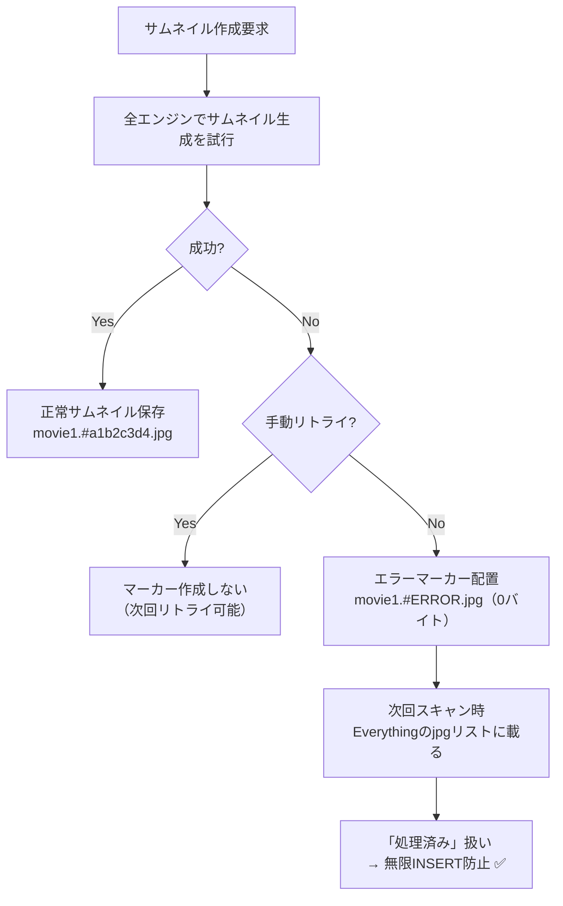

# Everything to Everything 差分検証アーキテクチャの無限キュー防止 ── エラーマーカー（ダミーjpg）方式

## 課題

「Everythingで取得した動画一覧」と「Everythingで取得したサムネイル(jpg)一覧」を突き合わせ、jpgが無い動画を新規としてDB登録・キュー登録するアーキテクチャにおいて、**サムネイル作成が永続的に失敗する動画**（壊れたファイル・非対応コーデック等）が存在すると、スキャンのたびに「新規発見！」と誤判定され、**無限INSERT（または一意制約エラー）**が発生する問題。

## 解決策: エラーマーカー（ダミーjpg）方式

全エンジンがサムネイル生成に失敗した動画に対して、`動画名.#ERROR.jpg`（0バイト）を出力フォルダに配置する。

### 動作フロー



### なぜこの方式か

| 観点 | ① INSERT前のSELECTチェック | ② エラーマーカー方式 ✅ |
|---|---|---|
| **速度** | 毎回SQLiteアクセス発生 | ゼロI/O |
| **設計哲学との一致** | DB依存が残る | 「ファイルの実体 = 真実のソース」に完全一致 |
| **再試行の柔軟性** | DB操作が必要 | `*.#ERROR.jpg` を削除するだけ |

## 変更ファイル

| ファイル | 変更種別 | 概要 |
|---|---|---|
| `Thumbnail/ThumbnailPathResolver.cs` | MODIFY | `BuildErrorMarkerFileName` / `BuildErrorMarkerPath` / `IsErrorMarker` 追加 |
| `Thumbnail/ThumbnailCreationService.cs` | MODIFY | 全エンジン失敗時にエラーマーカーjpg出力（手動時は除外） |
| `Tests/.../ErrorMarkerTests.cs` | NEW | ユニットテスト8件 |

## 主要コード

### ThumbnailPathResolver（追加メソッド）

```csharp
// エラーマーカーの固定ハッシュ値
internal const string ErrorMarkerHash = "ERROR";

// エラーマーカーファイル名: 「動画名本体.#ERROR.jpg」
internal static string BuildErrorMarkerFileName(string movieNameOrPath)

// エラーマーカーのフルパス生成
internal static string BuildErrorMarkerPath(string outPath, string movieNameOrPath)

// 指定パスがエラーマーカーファイルかを判定
internal static bool IsErrorMarker(string thumbnailPath)
```

### ThumbnailCreationService（挿入箇所）

`CreateThumbAsync` の全エンジンフォールバックループ終了後:

```csharp
// 全エンジン失敗 かつ 手動でない場合のみマーカー出力
if (!result.IsSuccess && !isManual)
{
    string errorMarkerPath = ThumbnailPathResolver.BuildErrorMarkerPath(
        tbi.OutPath, movieFullPath
    );
    if (!Path.Exists(errorMarkerPath))
    {
        File.WriteAllBytes(errorMarkerPath, []);
    }
}
```

## 再試行の運用手順

エラーマーカーつき動画を再処理したい場合:

```powershell
# エラーマーカーを一括削除 → 次回スキャンで自動リカバリ対象に復活
Remove-Item "C:\サムネイルフォルダ\*.#ERROR.jpg"
```

## テスト結果

テスト8件全て成功 ✅ （2026-02-28）
