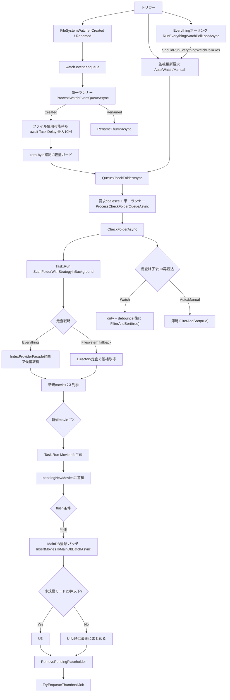

# フローチャート（メインDB登録 非同期化の現状 / 2026-03-05 更新）

## 1. いまの全体像（Everything分岐 + 一本化）

## 2. Everything分岐と一本化ポイント

- `CheckFolderAsync` の分岐点は `ScanFolderWithStrategyInBackground`。
  - `Everything` 利用可能: `IndexProviderFacade` 経由で候補取得。
  - 利用不可/対象外: `Filesystem fallback`（Directory走査）へ切替。
- 分岐後は、どちらも `NewMoviePaths` を同じ後段へ渡す。
  - `MovieInfo` 生成（`Task.Run`）
  - MainDB登録（`InsertMoviesToMainDbBatchAsync`）
  - UI反映（小規模時 `TryAppendMovieToViewByPathAsync`）
  - サムネキュー投入（`TryEnqueueThumbnailJob`）
- `FileChanged` / `FileRenamed` は、どちらも watch event queue へ積んでから処理する。
  - `Created` は file ready 待ちと zero-byte 判定の後で `QueueCheckFolderAsync(CheckMode.Watch, ...)` へ合流する。
  - `Renamed` は `RenameThumbAsync` を単一ランナーで順番に流す。
  - これで watcher イベントハンドラ自体は重い処理を持たない。
- `pendingNewMovies` の flush は `Watcher/MainWindow.WatchScanCoordinator.cs` へ寄せた。
  - `CheckFolderAsync` 側は「scanして flush を呼ぶ」形へ薄くし始めた。
  - flush 側で `MainDB登録 -> 小規模UI反映 -> placeholder解除 -> サムネ投入` をまとめて調停する。
- `new/existing` の per-file 判定も `ProcessScannedMovieAsync(...)` として `Watcher/MainWindow.WatchScanCoordinator.cs` へ寄せた。
  - `CheckFolderAsync` 側は probe 計測と folder 単位集計が主になった。
  - scan coordinator 側で `DB存在確認 -> view整合 -> missing thumb enqueue` を順番に握る。
- `CheckFolderAsync` 終端の全件 reload は、`CheckMode.Watch` の時だけ `dirty + debounce` で最新1回へ圧縮する。
  - `Manual` は即時反映のまま維持する。
  - `DB switch` 時は pending reload を取り消し、旧DB向けの stale 実行を止める。

## 3. まだUI詰まりに効く残課題

- `DataRowToViewData` 自体はUIスレッド実行（画像パス探索などが重い）。
- `FilterAndSort` は watch 連打時の即時実行は減ったが、実行1回あたりの全体再評価コストは依然として大きい。
- `FileChanged` の直書き経路は外れたが、watch終端の `FilterAndSort(..., true)` は依然として大きい。
