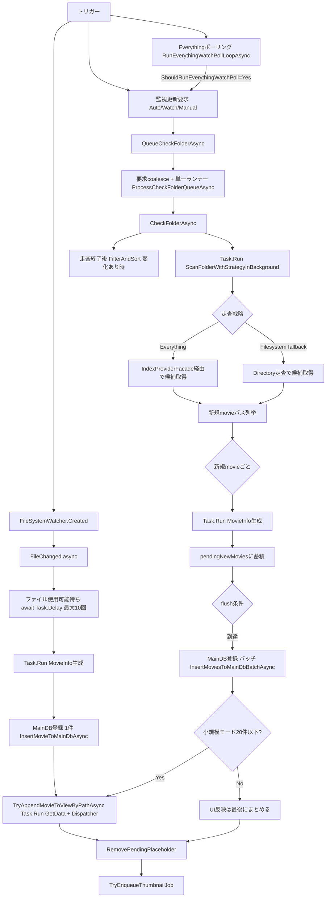

# フローチャート（メインDB登録 非同期化の現状 / 2026-03-05 更新）

## 1. いまの全体像（Everything分岐 + 一本化）

## 2. Everything分岐と一本化ポイント

- `CheckFolderAsync` の分岐点は `ScanFolderWithStrategyInBackground`。
  - `Everything` 利用可能: `IndexProviderFacade` 経由で候補取得。
  - 利用不可/対象外: `Filesystem fallback`（Directory走査）へ切替。
- 分岐後は、どちらも `NewMoviePaths` を同じ後段へ渡す。
  - `MovieInfo` 生成（`Task.Run`）
  - MainDB登録（`InsertMoviesToMainDbBatchAsync`）
  - UI反映（小規模時 `TryAppendMovieToViewByPathAsync`）
  - サムネキュー投入（`TryEnqueueThumbnailJob`）
- `FileChanged`（Createdイベント）経路も、後段は同じ思想で
  - MainDB登録（`InsertMovieToMainDbAsync`）
  - UI反映（`TryAppendMovieToViewByPathAsync`）
  - サムネキュー投入（`TryEnqueueThumbnailJob`）

## 3. まだUI詰まりに効く残課題

- `DataRowToViewData` 自体はUIスレッド実行（画像パス探索などが重い）。
- `FilterAndSort` は変更発生時に全体再評価が走る。
- `FileChanged` が高頻度連打される環境では、`async void` イベント処理が多重並行になる。
